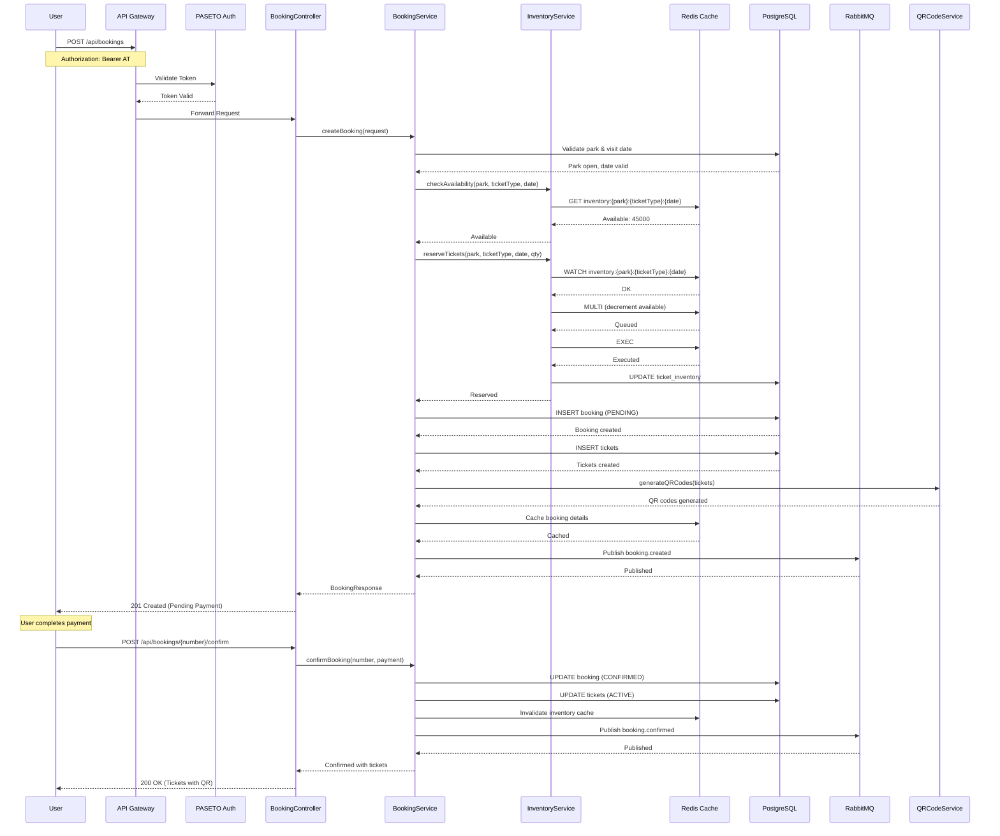
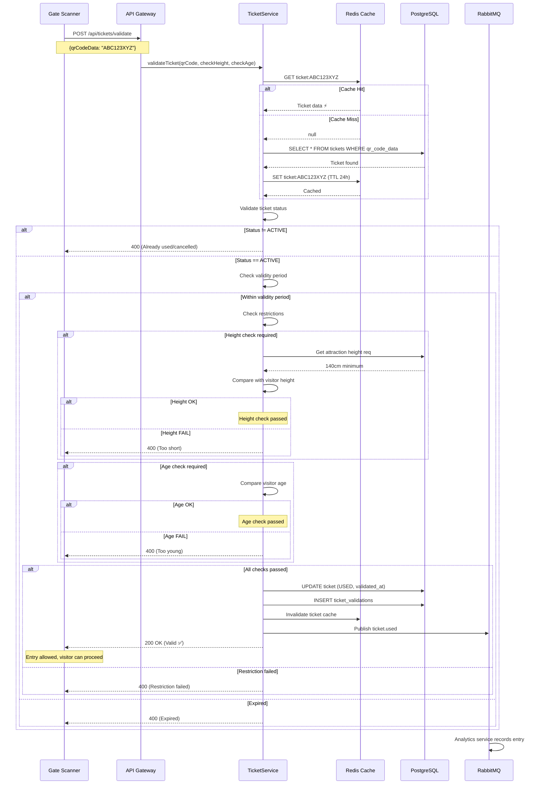
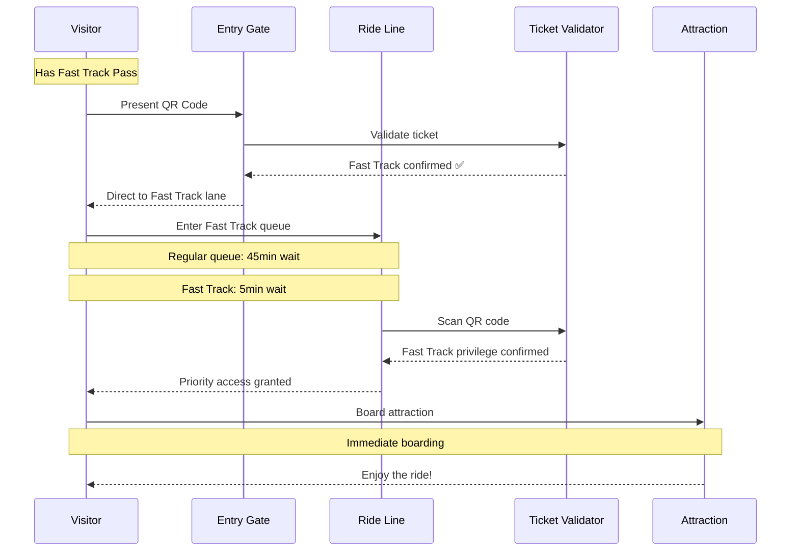
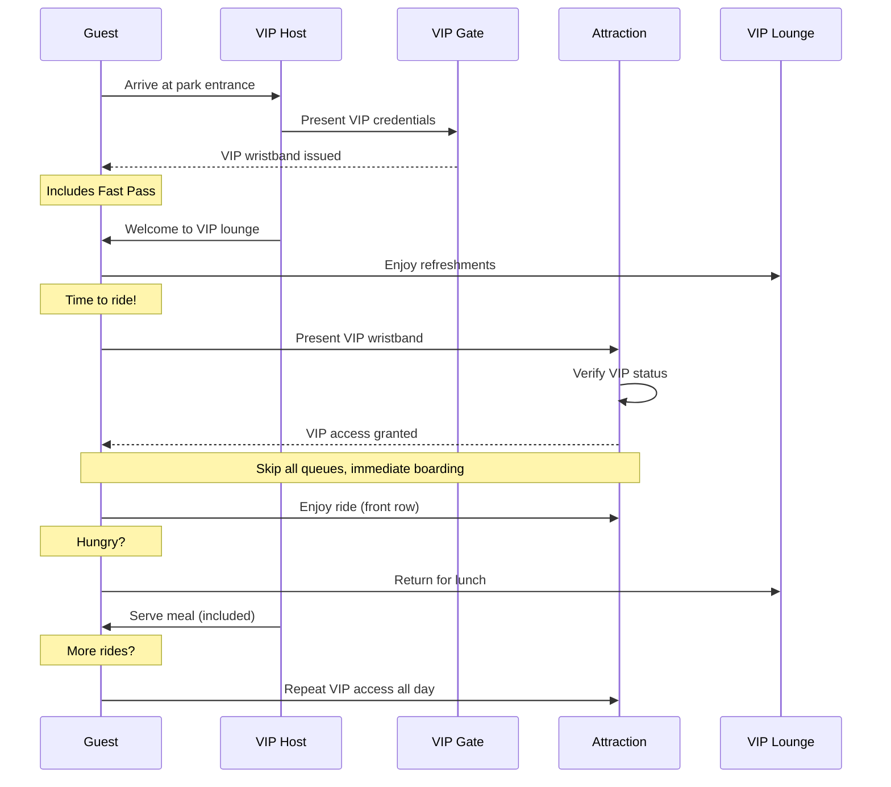
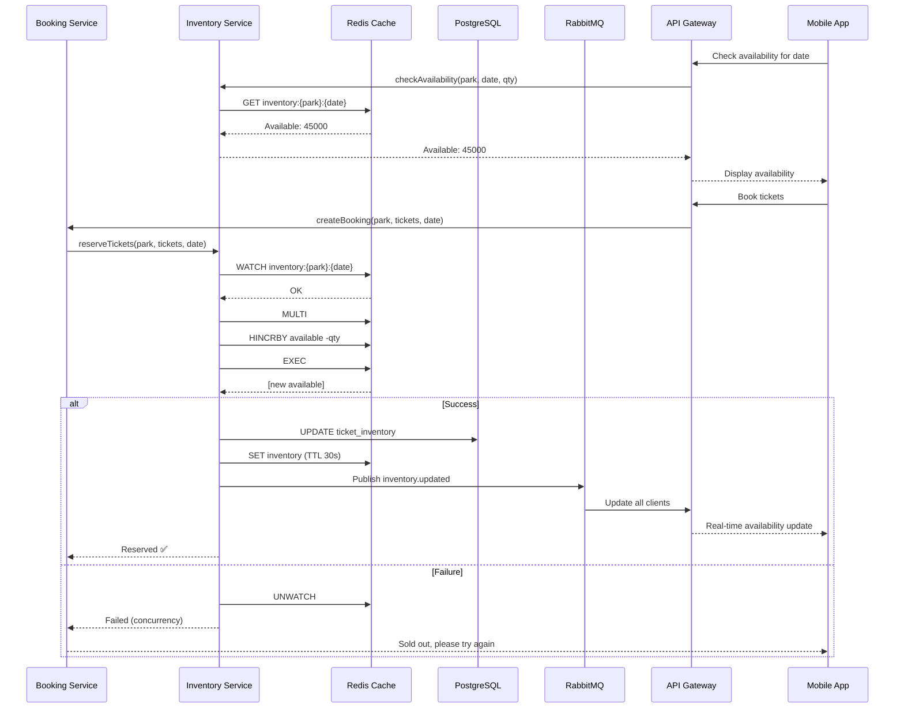

# Amusement Park Ticketing Microservice Architecture Design

A scalable, event-driven ticketing microservice for **Amusement Parks** built with **Spring Boot**, **Redis**, **RabbitMQ**, and **PostgreSQL**.

---

## Table of Contents

- [Architecture Overview](#architecture-overview)
- [Technology Stack](#technology-stack)
- [System Architecture](#system-architecture)
- [Database Schema](#database-schema)
- [Ticket Types Design](#ticket-types-design)
- [Booking & QR Code Design](#booking--qr-code-design)
- [Redis Caching Strategy](#redis-caching-strategy)
- [Virtual Threads Best Practices](#virtual-threads-best-practices)
- [RabbitMQ Message Queues](#rabbitmq-message-queues)
- [API Endpoints](#api-endpoints)
- [Sequence Diagrams](#sequence-diagrams)
- [Service Communication](#service-communication)
- [Error Handling & Resilience](#error-handling--resilience)
- [Configuration](#configuration)
- [Deployment](#deployment)
- [Monitoring & Observability](#monitoring--observability)

---

## Architecture Overview

### High-Level Architecture

```
┌─────────────────────────────────────────────────────────────────┐
│                         API Gateway                             │
│                    (Spring Cloud Gateway)                       │
│                  + PASETO Authentication                        │
└────────────────────────┬───────────────────────────────────────┘
                         │
                         │ HTTP/REST
                         ▼
┌─────────────────────────────────────────────────────────────────┐
│               Amusement Park Ticketing Service                 │
│                   (Spring Boot Application)                     │
│  ┌──────────────┐  ┌──────────────┐  ┌──────────────────────┐  │
│  │   Controller │  │   Service    │  │   Repository Layer   │  │
│  │              │  │              │  │                      │  │
│  │  - REST API  │  │  - Booking   │  │  - JPA/PostgreSQL   │  │
│  │  - Validation│  │  - QR Code   │  │  - Redis Cache      │  │
│  │  - Security  │  │  - Inventory │  │  - Search Engine    │  │
│  └──────────────┘  └──────────────┘  └──────────────────────┘  │
│         │                  │                    │                │
│         │                  │                    │                │
│         ▼                  ▼                    ▼                │
│  ┌──────────────────────────────────────────────────────────┐  │
│  │                   Message Producer                        │  │
│  │                   (RabbitMQ Publisher)                   │  │
│  └──────────────────────────────────────────────────────────┘  │
└─────────────────────────────────────────────────────────────────┘
                                │
                                │ AMQP
                                ▼
┌─────────────────────────────────────────────────────────────────┐
│                      RabbitMQ Broker                            │
│  ┌──────────────┐  ┌──────────────┐  ┌──────────────────────┐  │
│  │Booking Queue │  │  Notification│  │    Analytics Queue   │  │
│  │              │  │    Queue     │  │                      │  │
│  │  - Created   │  │  - Email     │  │  - Sales Metrics     │  │
│  │  - Confirmed │  │  - SMS       │  │  - Revenue Reports   │  │
│  │  - Cancelled │  │  - Push      │  │  - Attendance        │  │
│  └──────────────┘  └──────────────┘  └──────────────────────┘  │
└─────────────────────────────────────────────────────────────────┘
                                │
                                │ Consumed By
                                ▼
┌───────────────┐  ┌───────────────┐  ┌──────────────────────────┐
│ Notification  │  │   Analytics   │  │      Payment Service      │
│   Service     │  │    Service    │  │                          │
│               │  │               │  │  - Payment Processing    │
│  - Email      │  │  - Reports    │  │  - Refunds               │
│  - SMS        │  │  - Dashboard  │  │  - Invoice Generation    │
│  - Push       │  │  - Export     │  │                          │
└───────────────┘  └───────────────┘  └──────────────────────────┘
```

### Ticket Type Architecture

```
┌─────────────────────────────────────────────────────────────────┐
│              Amusement Park Ticketing System                    │
└─────────────────────────────────────────────────────────────────┘
                          │
        ┌─────────────────┼─────────────────┐
        │                 │                 │
        ▼                 ▼                 ▼
┌──────────────┐  ┌──────────────┐  ┌──────────────┐
│ SINGLE RIDE  │  │ ALL-DAY PASS │  │  VIP PACK    │
│   TICKETS    │  │    TICKETS   │  │   TICKETS    │
├──────────────┤  ├──────────────┤  ├──────────────┤
│ • Per ride   │  │ • Unlimited  │  │ • Unlimited  │
│ • Regular    │  │ • Regular    │  │ • VIP Access │
│ • Fast Track │  │ • Fast Track │  │ • All perks  │
│ • Height/Age │  │ • Height/Age │  │ • Skip queue │
└──────────────┘  └──────────────┘  └──────────────┘
```

---

## Technology Stack

| Component | Technology | Version | Purpose |
|-----------|-----------|---------|---------|
| **Runtime** | Java | 25 LTS | Application runtime |
| **Framework** | Spring Boot | 4.0.1 | Microservice framework |
| **Database** | PostgreSQL | 16+ | Primary data store |
| **Cache** | Redis | 7.2+ | Caching, pub/sub, inventory |
| **Message Broker** | RabbitMQ | 3.12+ | Event-driven messaging |
| **ORM** | Spring Data JPA | 3.2+ | Database abstraction |
| **Cache Client** | Spring Data Redis | 3.2+ | Redis integration |
| **AMQP Client** | Spring AMQP | 3.1+ | RabbitMQ client |
| **QR Code** | ZXing | 3.5+ | QR code generation |
| **Search** | PostgreSQL Full-Text | - | Attraction search |
| **API Documentation** | SpringDoc OpenAPI | 2.3+ | Swagger UI |
| **Monitoring** | Spring Boot Actuator | 3.2+ | Metrics & health |
| **Tracing** | Micrometer Tracing | 1.2+ | Distributed tracing |

---

## System Architecture

### Package Structure

```
com.amusementpark.ticketing/
├── config/
│   ├── RedisConfig.java              # Redis configuration
│   ├── RabbitMQConfig.java           # RabbitMQ setup
│   ├── CacheConfig.java              # Cache settings
│   ├── AsyncConfig.java              # Async execution with virtual threads
│   ├── VirtualThreadConfig.java      # Virtual threads configuration
│   └── QRCodeConfig.java             # QR code generation
├── controller/
│   ├── ParkController.java           # Park management
│   ├── AttractionController.java     # Ride/attraction endpoints
│   ├── TicketTypeController.java     # Ticket type management
│   ├── BookingController.java        # Booking operations
│   ├── TicketController.java         # Ticket verification
│   └── ValidatorController.java      # Gate validation endpoints
├── dto/
│   ├── request/
│   │   ├── CreateParkRequest.java
│   │   ├── CreateBookingRequest.java
│   │   ├── SearchAttractionsRequest.java
│   │   └── ValidateTicketRequest.java
│   └── response/
│       ├── ParkResponse.java
│       ├── AttractionResponse.java
│       ├── BookingResponse.java
│       ├── TicketResponse.java
│       └── AvailabilityResponse.java
├── entity/
│   ├── Park.java                     # Amusement park entity
│   ├── Attraction.java               # Ride/attraction entity
│   ├── AttractionCategory.java       # Ride categories
│   ├── TicketType.java               # Ticket categories
│   ├── PricingTier.java              # Pricing levels
│   ├── ParkSchedule.java             # Operating hours
│   ├── Booking.java                  # Booking records
│   ├── Ticket.java                   # Individual tickets
│   ├── TicketInventory.java          # Available inventory
│   ├── TicketValidation.java         # Validation logs
│   └── VisitorPass.java              # Multi-day visitor passes
├── repository/
│   ├── ParkRepository.java
│   ├── AttractionRepository.java
│   ├── TicketTypeRepository.java
│   ├── BookingRepository.java
│   ├── TicketRepository.java
│   └── TicketInventoryRepository.java
├── service/
│   ├── ParkService.java
│   ├── AttractionService.java
│   ├── BookingService.java
│   ├── TicketService.java
│   ├── QRCodeService.java
│   ├── InventoryService.java
│   ├── ValidationService.java
│   ├── CacheService.java
│   └── MessagePublisher.java
├── listener/
│   └── BookingEventListener.java     # RabbitMQ consumer
├── enums/
│   ├── AttractionType.java           # ROLLER_COASTER, WATER_RIDE, etc.
│   ├── TicketStatus.java             # ACTIVE, USED, REFUNDED
│   ├── TicketCategory.java           # SINGLE, ALL_DAY, VIP
│   ├── BookingStatus.java            # PENDING, CONFIRMED, CANCELLED
│   └── VisitorType.java              # ADULT, CHILD, SENIOR
├── exception/
│   ├── ParkNotFoundException.java
│   ├── AttractionUnavailableException.java
│   ├── InvalidTicketException.java
│   ├── HeightRestrictionException.java
│   └── GlobalExceptionHandler.java
├── util/
│   ├── QRCodeGenerator.java
│   ├── TicketNumberGenerator.java
│   └── PricingCalculator.java
└── mapper/
    └── TicketingMapper.java
```

---

## Database Schema

### Complete ER Diagram

```
┌──────────────────┐       ┌──────────────────┐       ┌──────────────────┐
│      Park        │       │   Attraction     │       │ AttractionCategory│
├──────────────────┤       ├──────────────────┤       ├──────────────────┤
│ id (PK)         │       │ id (PK)         │       │ id (PK)         │
│ name            │◄──────│ park_id (FK)    │◄──────│ category_id (FK)│
│ slug            │       │ name            │       │ name            │
│ description     │       │ type (ENUM)     │       │ description     │
│ address         │       │ category_id     │       └──────────────────┘
│ city            │       │ height_restr    │
│ country         │       │ age_restriction │
│ latitude        │       │ duration_min    │
│ longitude       │       │ capacity_per_ride│
│ logo_url        │       │ fast_track_avail│
│ facilities      │       │ vip_avail       │
│ operating_hours │       │ is_weather_dep   │
│ created_at      │       │ active          │
│ updated_at      │       │ created_at      │
└──────────────────┘       │ updated_at      │
                          │ metadata (JSONB)│
                          └────────┬─────────┘
                                   │
                                   ▼
                        ┌──────────────────┐
                        │  TicketType     │
                        ├──────────────────┤
                        │ id (PK)         │
                        │ park_id (FK)    │
                        │ attraction_id FK│
                        │ name            │
                        │ category (ENUM) │
                        │ description     │
                        │ base_price      │
                        │ capacity        │
                        │ available       │
                        │ is_active       │
                        │ metadata (JSONB)│
                        └────────┬─────────┘
                                 │
                                 ▼
                        ┌──────────────────┐
                        │  PricingTier    │
                        ├──────────────────┤
                        │ id (PK)         │
                        │ ticket_type_id  │
                        │ name            │
                        │ price           │
                        │ benefits (JSONB)│
                        │ is_active       │
                        └──────────────────┘
                                 │
                                 ▼
                        ┌──────────────────┐
                        │    Booking      │
                        ├──────────────────┤
                        │ id (PK)         │
                        │ booking_number  │
                        │ park_id (FK)    │
                        │ user_id (FK)    │
                        │ visit_date      │
                        │ status          │
                        │ total_amount    │
                        │ payment_status  │
                        │ booked_at       │
                        │ confirmed_at    │
                        └────────┬─────────┘
                                 │
                                 ▼
                        ┌──────────────────┐
                        │     Ticket      │
                        ├──────────────────┤
                        │ id (PK)         │
                        │ booking_id (FK) │
                        │ ticket_number  │
                        │ ticket_type_id  │
                        │ qr_code_data    │
                        │ status          │
                        │ price_paid      │
                        │ valid_from      │
                        │ valid_until     │
                        │ used_at         │
                        │ validated_at    │
                        └──────────────────┘
```

### Tables

#### 1. parks

```sql
CREATE TABLE parks (
    id BIGSERIAL PRIMARY KEY,
    name VARCHAR(200) NOT NULL,
    slug VARCHAR(200) UNIQUE NOT NULL,
    description TEXT,
    short_description VARCHAR(500),
    address TEXT NOT NULL,
    city VARCHAR(100) NOT NULL,
    country VARCHAR(100) NOT NULL DEFAULT 'Indonesia',
    latitude DECIMAL(10, 8),
    longitude DECIMAL(11, 8),
    logo_url VARCHAR(500),
    banner_url VARCHAR(500),
    facilities TEXT[],
    operating_hours JSONB,
    contact_info JSONB,
    is_active BOOLEAN NOT NULL DEFAULT true,
    created_at TIMESTAMP NOT NULL DEFAULT CURRENT_TIMESTAMP,
    updated_at TIMESTAMP NOT NULL DEFAULT CURRENT_TIMESTAMP
);

CREATE INDEX idx_parks_slug ON parks(slug);
CREATE INDEX idx_parks_city ON parks(city);
CREATE INDEX idx_parks_active ON parks(is_active);
CREATE INDEX idx_parks_location ON parks USING GIST(
    ll_to_earth(latitude, longitude)
);
```

#### 2. attraction_categories

```sql
CREATE TYPE attraction_type AS ENUM (
    'ROLLER_COASTER',
    'WATER_RIDE',
    'FAMILY_RIDE',
    'THRILL_RIDE',
    'KIDS_RIDE',
    'SIMULATOR',
    'DARK_RIDE',
    'SHOW',
    'CAROUSEL',
    'TRAIN',
    'SPINNING'
);

CREATE TABLE attraction_categories (
    id SERIAL PRIMARY KEY,
    name VARCHAR(100) NOT NULL UNIQUE,
    description TEXT,
    icon_url VARCHAR(500),
    display_order INTEGER DEFAULT 0,
    is_active BOOLEAN NOT NULL DEFAULT true,
    created_at TIMESTAMP NOT NULL DEFAULT CURRENT_TIMESTAMP
);

CREATE INDEX idx_categories_active ON attraction_categories(is_active);
CREATE INDEX idx_categories_order ON attraction_categories(display_order);
```

#### 3. attractions

```sql
CREATE TABLE attractions (
    id BIGSERIAL PRIMARY KEY,
    park_id BIGINT NOT NULL REFERENCES parks(id) ON DELETE CASCADE,
    category_id BIGINT REFERENCES attraction_categories(id),
    name VARCHAR(200) NOT NULL,
    slug VARCHAR(200) NOT NULL,
    description TEXT,
    short_description VARCHAR(500),
    type attraction_type NOT NULL,
    thumbnail_url VARCHAR(500),
    images TEXT[],

    -- Ride Requirements
    height_restriction_cm INTEGER,
    age_restriction INTEGER,
    max_weight_kg INTEGER,
    min_height_cm INTEGER,
    max_height_cm INTEGER,

    -- Ride Details
    duration_minutes INTEGER NOT NULL,
    capacity_per_rider INTEGER DEFAULT 6,
    riders_per_hour INTEGER,

    -- Pricing Options
    single_ride_price DECIMAL(12, 2) NOT NULL,
    fast_track_available BOOLEAN NOT NULL DEFAULT false,
    fast_track_price_multiplier DECIMAL(3, 2) DEFAULT 1.5,
    vip_available BOOLEAN NOT NULL DEFAULT false,
    vip_price_multiplier DECIMAL(3, 2) DEFAULT 2.0,

    -- Availability
    is_all_day_included BOOLEAN DEFAULT false,
    all_day_pass_available BOOLEAN DEFAULT true,

    -- Operational
    is_weather_dependent BOOLEAN DEFAULT false,
    requires_glasses BOOLEAN DEFAULT false,
    requires_loose_articles BOOLEAN DEFAULT false,

    -- Additional Features
    photo_package_available BOOLEAN DEFAULT false,
    photo_package_price DECIMAL(10, 2),
    on_ride_video_available BOOLEAN DEFAULT false,
    on_ride_video_price DECIMAL(10, 2),

    -- Safety & Requirements
    safety_requirements TEXT,
    health_restrictions TEXT[],
    not_recommended_for TEXT[],

    active BOOLEAN NOT NULL DEFAULT true,
    created_at TIMESTAMP NOT NULL DEFAULT CURRENT_TIMESTAMP,
    updated_at TIMESTAMP NOT NULL DEFAULT CURRENT_TIMESTAMP,

    UNIQUE(park_id, slug)
);

CREATE INDEX idx_attractions_park ON attractions(park_id);
CREATE INDEX idx_attractions_category ON attractions(category_id);
CREATE INDEX idx_attractions_type ON attractions(type);
CREATE INDEX idx_attractions_active ON attractions(active);
CREATE INDEX idx_attractions_height ON attractions(height_restriction_cm);
CREATE INDEX idx_attractions_slug ON attractions(slug);
```

#### 4. park_schedules

```sql
CREATE TABLE park_schedules (
    id BIGSERIAL PRIMARY KEY,
    park_id BIGINT NOT NULL REFERENCES parks(id) ON DELETE CASCADE,
    schedule_date DATE NOT NULL,
    opening_time TIME NOT NULL,
    closing_time TIME NOT NULL,
    is_special_hours BOOLEAN DEFAULT false,
    special_event_name VARCHAR(200),
    max_visitors INTEGER,
    created_at TIMESTAMP NOT NULL DEFAULT CURRENT_TIMESTAMP,
    UNIQUE(park_id, schedule_date)
);

CREATE INDEX idx_schedules_park ON park_schedules(park_id);
CREATE INDEX idx_schedules_date ON park_schedules(schedule_date);
CREATE INDEX idx_schedules_park_date ON park_schedules(park_id, schedule_date);
```

#### 5. ticket_types

```sql
CREATE TYPE ticket_category AS ENUM (
    'SINGLE_RIDE',
    'ALL_DAY_PASS',
    'ALL_DAY_FAST_TRACK',
    'VIP_EXPERIENCE',
    'KIDS_PASS',
    'SENIOR_PASS',
    'GROUP_PASS',
    'SEASON_PASS'
);

CREATE TABLE ticket_types (
    id BIGSERIAL PRIMARY KEY,
    park_id BIGINT NOT NULL REFERENCES parks(id) ON DELETE CASCADE,
    attraction_id BIGINT REFERENCES attractions(id) ON DELETE CASCADE,
    name VARCHAR(200) NOT NULL,
    description TEXT,
    category ticket_category NOT NULL,
    base_price DECIMAL(12, 2) NOT NULL,

    -- Pricing
    weekend_price DECIMAL(12, 2),
    holiday_price DECIMAL(12, 2),
    peak_season_price DECIMAL(12, 2),

    -- Capacity
    capacity INTEGER NOT NULL,
    available INTEGER NOT NULL,
    max_tickets_per_booking INTEGER DEFAULT 20,

    -- Validity
    sale_start_date TIMESTAMP NOT NULL,
    sale_end_date TIMESTAMP,
    valid_from DATE NOT NULL,
    valid_until DATE NOT NULL,

    -- Age/Height Requirements
    min_age INTEGER,
    max_age INTEGER,
    height_min_cm INTEGER,
    height_max_cm INTEGER,

    active BOOLEAN NOT NULL DEFAULT true,
    metadata JSONB,
    created_at TIMESTAMP NOT NULL DEFAULT CURRENT_TIMESTAMP,
    updated_at TIMESTAMP NOT NULL DEFAULT CURRENT_TIMESTAMP
);

CREATE INDEX idx_ticket_types_park ON ticket_types(park_id);
CREATE INDEX idx_ticket_types_attraction ON ticket_types(attraction_id);
CREATE INDEX idx_ticket_types_category ON ticket_types(category);
CREATE INDEX idx_ticket_types_active ON ticket_types(active);
CREATE INDEX idx_ticket_types_dates ON ticket_types(valid_from, valid_until);
CREATE INDEX idx_ticket_types_park_active ON ticket_types(park_id, active);
```

#### 6. pricing_tiers

```sql
CREATE TABLE pricing_tiers (
    id BIGSERIAL PRIMARY KEY,
    ticket_type_id BIGINT NOT NULL REFERENCES ticket_types(id) ON DELETE CASCADE,
    name VARCHAR(100) NOT NULL,
    description TEXT,
    price DECIMAL(12, 2) NOT NULL,
    benefits JSONB,
    restrictions JSONB,
    is_active BOOLEAN NOT NULL DEFAULT true,
    valid_from TIMESTAMP,
    valid_until TIMESTAMP,
    created_at TIMESTAMP NOT NULL DEFAULT CURRENT_TIMESTAMP
);

CREATE INDEX idx_pricing_tiers_ticket_type ON pricing_tiers(ticket_type_id);
CREATE INDEX idx_pricing_tiers_active ON pricing_tiers(is_active);
CREATE INDEX idx_pricing_tiers_dates ON pricing_tiers(valid_from, valid_until);
```

#### 7. ticket_packages

```sql
CREATE TABLE ticket_packages (
    id BIGSERIAL PRIMARY KEY,
    park_id BIGINT NOT NULL REFERENCES parks(id) ON DELETE CASCADE,
    name VARCHAR(200) NOT NULL,
    slug VARCHAR(200) UNIQUE NOT NULL,
    description TEXT,
    package_type VARCHAR(50) NOT NULL, -- VIP, FAMILY, CORPORATE, SCHOOL
    total_price DECIMAL(12, 2) NOT NULL,
    discount_percent INTEGER DEFAULT 0,
    max_visitors INTEGER,
    includes TEXT[],
    benefits JSONB,
    restrictions JSONB,
    terms_conditions TEXT,
    active BOOLEAN NOT NULL DEFAULT true,
    valid_from DATE NOT NULL,
    valid_until DATE,
    created_at TIMESTAMP NOT NULL DEFAULT CURRENT_TIMESTAMP,
    updated_at TIMESTAMP NOT NULL DEFAULT CURRENT_TIMESTAMP
);

CREATE INDEX idx_packages_park ON ticket_packages(park_id);
CREATE INDEX idx_packages_slug ON ticket_packages(slug);
CREATE INDEX idx_packages_type ON ticket_packages(package_type);
CREATE INDEX idx_packages_active ON ticket_packages(active);
CREATE INDEX idx_packages_dates ON ticket_packages(valid_from, valid_until);
```

#### 8. bookings

```sql
CREATE TYPE booking_status AS ENUM ('PENDING', 'CONFIRMED', 'CANCELLED', 'REFUNDED', 'EXPIRED');
CREATE TYPE payment_status AS ENUM ('PENDING', 'COMPLETED', 'FAILED', 'REFUNDED');

CREATE TABLE bookings (
    id BIGSERIAL PRIMARY KEY,
    booking_number VARCHAR(50) UNIQUE NOT NULL,
    park_id BIGINT NOT NULL REFERENCES parks(id),
    user_id BIGINT NOT NULL,
    visit_date DATE NOT NULL,

    -- Booking Details
    status booking_status NOT NULL DEFAULT 'PENDING',
    payment_status payment_status NOT NULL DEFAULT 'PENDING',

    -- Pricing
    subtotal_amount DECIMAL(12, 2) NOT NULL,
    discount_amount DECIMAL(12, 2) DEFAULT 0,
    tax_amount DECIMAL(12, 2) DEFAULT 0,
    total_amount DECIMAL(12, 2) NOT NULL,
    currency VARCHAR(3) DEFAULT 'IDR',

    -- Payment
    payment_id VARCHAR(200),
    payment_method VARCHAR(50),

    -- Timestamps
    booked_at TIMESTAMP NOT NULL DEFAULT CURRENT_TIMESTAMP,
    confirmed_at TIMESTAMP,
    cancelled_at TIMESTAMP,
    refunded_at TIMESTAMP,
    expires_at TIMESTAMP NOT NULL,

    -- Visitor Information
    visitor_count INTEGER NOT NULL,
    visitor_info JSONB NOT NULL,

    metadata JSONB
);

CREATE INDEX idx_bookings_number ON bookings(booking_number);
CREATE INDEX idx_bookings_park ON bookings(park_id);
CREATE INDEX idx_bookings_user ON bookings(user_id);
CREATE INDEX idx_bookings_status ON bookings(status);
CREATE INDEX idx_bookings_payment_status ON bookings(payment_status);
CREATE INDEX idx_bookings_visit_date ON bookings(visit_date);
CREATE INDEX idx_bookings_created_at ON bookings(booked_at DESC);
CREATE INDEX idx_bookings_user_status ON bookings(user_id, status);
```

#### 9. tickets

```sql
CREATE TYPE ticket_status AS ENUM ('ACTIVE', 'USED', 'CANCELLED', 'REFUNDED', 'EXPIRED');

CREATE TABLE tickets (
    id BIGSERIAL PRIMARY KEY,
    booking_id BIGINT NOT NULL REFERENCES bookings(id) ON DELETE CASCADE,
    ticket_number VARCHAR(50) UNIQUE NOT NULL,
    ticket_type_id BIGINT REFERENCES ticket_types(id),
    attraction_id BIGINT REFERENCES attractions(id),

    -- Ticket Details
    qr_code_data TEXT NOT NULL,
    qr_code_url VARCHAR(500),
    barcode_data VARCHAR(200),
    status ticket_status NOT NULL DEFAULT 'ACTIVE',

    -- Pricing
    price_paid DECIMAL(12, 2) NOT NULL,
    currency VARCHAR(3) DEFAULT 'IDR',

    -- Visitor Information
    visitor_name VARCHAR(200),
    visitor_type VARCHAR(50), -- ADULT, CHILD, SENIOR

    -- Validity
    valid_from TIMESTAMP NOT NULL,
    valid_until TIMESTAMP NOT NULL,

    -- Usage Tracking
    used_at TIMESTAMP,
    validated_at TIMESTAMP,
    validated_by BIGINT,
    validation_location VARCHAR(200),
    validation_method VARCHAR(50),

    -- Restrictions
    height_restriction_override BOOLEAN DEFAULT false,
    age_verified BOOLEAN DEFAULT false,

    metadata JSONB,
    created_at TIMESTAMP NOT NULL DEFAULT CURRENT_TIMESTAMP,
    updated_at TIMESTAMP NOT NULL DEFAULT CURRENT_TIMESTAMP
);

CREATE INDEX idx_tickets_booking ON tickets(booking_id);
CREATE INDEX idx_tickets_number ON tickets(ticket_number);
CREATE INDEX idx_tickets_qr ON tickets(qr_code_data);
CREATE INDEX idx_tickets_attraction ON tickets(attraction_id);
CREATE INDEX idx_tickets_status ON tickets(status);
CREATE INDEX idx_tickets_valid_until ON tickets(valid_until);
CREATE INDEX idx_tickets_visitor_name ON tickets(visitor_name);
```

#### 10. ticket_inventory (Real-time Inventory)

```sql
CREATE TABLE ticket_inventory (
    id BIGSERIAL PRIMARY KEY,
    park_id BIGINT NOT NULL REFERENCES parks(id) ON DELETE CASCADE,
    attraction_id BIGINT REFERENCES attractions(id),
    ticket_type_id BIGINT REFERENCES ticket_types(id),
    visit_date DATE NOT NULL,

    -- Inventory Numbers
    total_capacity INTEGER NOT NULL,
    available INTEGER NOT NULL,
    reserved INTEGER NOT NULL DEFAULT 0,
    sold INTEGER NOT NULL DEFAULT 0,
    locked INTEGER NOT NULL DEFAULT 0,

    -- Fast Track & VIP Slots
    fast_track_available INTEGER DEFAULT 0,
    vip_available INTEGER DEFAULT 0,

    -- Timestamps
    last_updated TIMESTAMP NOT NULL DEFAULT CURRENT_TIMESTAMP,
    version INTEGER NOT NULL DEFAULT 0,

    UNIQUE(park_id, attraction_id, ticket_type_id, visit_date)
);

CREATE INDEX idx_inventory_park ON ticket_inventory(park_id);
CREATE INDEX idx_inventory_attraction ON ticket_inventory(attraction_id);
CREATE INDEX idx_inventory_type ON ticket_inventory(ticket_type_id);
CREATE INDEX idx_inventory_date ON ticket_inventory(visit_date);
CREATE INDEX idx_inventory_available ON ticket_inventory(available);
CREATE INDEX idx_inventory_park_date ON ticket_inventory(park_id, visit_date);
```

#### 11. ticket_validations (Audit Log)

```sql
CREATE TYPE validation_result AS ENUM ('VALID', 'INVALID', 'DUPLICATE', 'EXPIRED', 'RESTRICTION_FAILED');

CREATE TABLE ticket_validations (
    id BIGSERIAL PRIMARY KEY,
    ticket_id BIGINT NOT NULL REFERENCES tickets(id),
    validation_time TIMESTAMP NOT NULL DEFAULT CURRENT_TIMESTAMP,

    -- Validation Details
    validation_result validation_result NOT NULL,
    validator_id BIGINT,
    validation_method VARCHAR(50) NOT NULL, -- QR_SCAN, BARCODE_SCAN, MANUAL, NFC
    validation_location VARCHAR(200),

    -- Device Info
    device_info JSONB,
    ip_address INET,
    user_agent TEXT,

    -- Restriction Checks
    height_checked BOOLEAN DEFAULT false,
    height_verified_cm INTEGER,
    age_checked BOOLEAN DEFAULT false,
    age_verified_years INTEGER,

    metadata JSONB
);

CREATE INDEX idx_validations_ticket ON ticket_validations(ticket_id);
CREATE INDEX idx_validations_time ON ticket_validations(validation_time DESC);
CREATE INDEX idx_validations_result ON ticket_validations(validation_result);
CREATE INDEX idx_validations_location ON ticket_validations(validation_location);
```

#### 12. visitor_passes (Multi-Day/Season Passes)

```sql
CREATE TABLE visitor_passes (
    id BIGSERIAL PRIMARY KEY,
    user_id BIGINT NOT NULL,
    park_id BIGINT NOT NULL REFERENCES parks(id),
    pass_number VARCHAR(50) UNIQUE NOT NULL,
    pass_type VARCHAR(50) NOT NULL, -- MULTI_DAY, SEASON, ANNUAL
    total_visits_allowed INTEGER,
    visits_remaining INTEGER NOT NULL,

    -- Validity
    valid_from DATE NOT NULL,
    valid_until DATE NOT NULL,
    is_active BOOLEAN NOT NULL DEFAULT true,

    -- Photo
    photo_url VARCHAR(500),

    created_at TIMESTAMP NOT NULL DEFAULT CURRENT_TIMESTAMP,
    updated_at TIMESTAMP NOT NULL DEFAULT CURRENT_TIMESTAMP
);

CREATE INDEX idx_visitor_passes_user ON visitor_passes(user_id);
CREATE INDEX idx_visitor_passes_park ON visitor_passes(park_id);
CREATE INDEX idx_visitor_passes_number ON visitor_passes(pass_number);
CREATE INDEX idx_visitor_passes_active ON visitor_passes(is_active);
CREATE INDEX idx_visitor_passes_dates ON visitor_passes(valid_from, valid_until);
```

---

## Ticket Types Design

### 1. Single Ride Tickets

#### Features
```sql
-- Single Ride Ticket Attributes
CREATE TABLE single_ride_features (
    ticket_type_id BIGINT PRIMARY KEY REFERENCES ticket_types(id),
    includes_fast_track BOOLEAN DEFAULT false,
    includes_photo BOOLEAN DEFAULT false,
    includes_video BOOLEAN DEFAULT false,
    priority_seating BOOLEAN DEFAULT false,
    companion_discount INTEGER DEFAULT 0
);
```

#### Pricing Example
```
┌─────────────────────────────────────────────────────────────┐
│              SINGLE RIDE PRICING MODEL                       │
│                                                             │
│  Regular Queue Pricing:                                     │
│  • Roller Coaster: IDR 50,000                              │
│  • Water Ride: IDR 40,000                                   │
│  • Family Ride: IDR 30,000                                  │
│  • Kids Ride: IDR 20,000                                    │
│                                                             │
│  Fast Track Pricing (Skip Queue):                            │
│  • 1.5x multiplier on regular price                          │
│  • Roller Coaster: IDR 75,000 (50K × 1.5)                  │
│  • Water Ride: IDR 60,000 (40K × 1.5)                      │
│  • Family Ride: IDR 45,000 (30K × 1.5)                      │
│                                                             │
│  VIP Access Pricing (Skip All Queues):                       │
│  • 2.0x multiplier on regular price                          │
│  • Roller Coaster: IDR 100,000 (50K × 2.0)                │
│  • Water Ride: IDR 80,000 (40K × 2.0)                      │
│  • Family Ride: IDR 60,000 (30K × 2.0)                      │
│                                                             │
│  Add-ons:                                                    │
│  • Photo Package: IDR 30,000                                │
│  • On-Ride Video: IDR 50,000                                │
│  • Souvenir Discount: 10%                                   │
└─────────────────────────────────────────────────────────────┘
```

#### Ticket Types
```json
{
  "attraction": "Hyper Coaster",
  "singleRideTickets": [
    {
      "name": "Single Ride - Regular",
      "price": 50000,
      "queueType": "REGULAR",
      "estimatedWaitTime": "45 minutes",
      "benefits": [
        "One-time access to Hyper Coaster",
        "Standard queue line"
      ],
      "restrictions": {
        "heightRestriction": "140cm minimum",
        "ageRestriction": "None (under 12 with adult)"
      }
    },
    {
      "name": "Single Ride - Fast Track",
      "price": 75000,
      "queueType": "FAST_TRACK",
      "estimatedWaitTime": "5 minutes",
      "benefits": [
        "Skip regular queue",
        "Priority boarding",
        "Express lane (80% faster)",
        "Reserved seating area"
      ],
      "restrictions": {
        "heightRestriction": "140cm minimum"
      }
    },
    {
      "name": "Single Ride - VIP Access",
      "price": 100000,
      "queueType": "VIP",
      "estimatedWaitTime": "0 minutes",
      "benefits": [
        "Skip ALL queues",
        "Immediate boarding",
        "VIP entrance",
        "Front row seating",
        "Complimentary photo"
      ],
      "restrictions": {
        "heightRestriction": "140cm minimum"
      }
    }
  ]
}
```

### 2. All-Day Pass Tickets

#### Features
```sql
-- All-Day Pass Attributes
CREATE TABLE all_day_pass_features (
    ticket_type_id BIGINT PRIMARY KEY REFERENCES ticket_types(id),
    includes_all_attractions BOOLEAN DEFAULT false,
    excluded_attractions INTEGER[], -- Array of attraction IDs
    unlimited_rides BOOLEAN DEFAULT true,
    max_visits_per_attraction INTEGER DEFAULT -1, -- -1 = unlimited
    photo_included BOOLEAN DEFAULT false,
    meal_voucher_included BOOLEAN DEFAULT false,
    meal_voucher_amount DECIMAL(10, 2),
    locker_included BOOLEAN DEFAULT false,
    souvenir_discount_percent INTEGER DEFAULT 0,
    priority_lane_access BOOLEAN DEFAULT false
);
```

#### Pricing Strategy
```
┌─────────────────────────────────────────────────────────────┐
│              ALL-DAY PASS PRICING MODEL                      │
│                                                             │
│  Regular All-Day Pass:                                      │
│  • Unlimited access to all regular rides                    │
│  • Regular queue for all attractions                        │
│  • Price: IDR 400,000                                       │
│  • Valid for 1 day                                          │
│  • Excludes: Go-Karts, Bungee Jumping, VR Experience        │
│                                                             │
│  Fast Track All-Day Pass:                                   │
│  • Unlimited access with Fast Track for all rides          │
│  • 50% shorter waiting time                                │
│  • Express lane at all attractions                          │
│  • Price: IDR 600,000 (1.5x regular)                       │
│  • Includes: ALL attractions (no exclusions)               │
│  • 10% discount on food & beverages                         │
│                                                             │
│  VIP Experience All-Day Pass:                              │
│  • Unlimited VIP access to ALL rides                        │
│  • Skip ALL queues - immediate boarding                     │
│  • VIP entrance at all attractions                          │
│  • Private lounge access                                    │
│  • Free locker rental                                       │
│  • Free meal voucher worth IDR 100,000                     │
│  • Photo package included                                   │
│  • 20% discount on all souvenirs                            │
│  • Personal attendant (optional, additional cost)          │
│  • Price: IDR 1,200,000 (3x regular)                        │
│                                                             │
│  Kids Fun Pass:                                             │
│  • Unlimited access to kids rides only                     │
│  • Valid for children 3-12 years old                       │
│  • 1 free adult supervision per child                        │
│  • Free ice cream                                           │
│  • Free stroller rental                                      │
│  • Price: IDR 150,000                                       │
│                                                             │
│  Senior Pass (60+ years):                                   │
│  • 25% discount on all passes                                │
│  • Valid ID required                                        │
│  • Weekday only (Mon-Fri)                                   │
└─────────────────────────────────────────────────────────────┘
```

#### Ticket Types
```json
{
  "park": "Fantasy World Amusement Park",
  "allDayPasses": [
    {
      "name": "All-Day Pass - Regular",
      "category": "ALL_DAY_PASS",
      "price": 400000,
      "weekendPrice": 450000,
      "holidayPrice": 500000,
      "validFor": "1 day (operating hours)",
      "includes": [
        "Unlimited rides on all regular attractions",
        "Access to shows and parades",
        "General admission to park"
      ],
      "excludes": [
        "Go-Karts (extra charge)",
        "Bungee Jumping (extra charge)",
        "VR Experience (extra charge)"
      ],
      "restrictions": {
        "heightRestrictions": "Apply per ride",
        "ageRestrictions": "Apply per ride",
        "validFor": "Single day use only"
      }
    },
    {
      "name": "All-Day Pass - Fast Track",
      "category": "ALL_DAY_FAST_TRACK",
      "price": 600000,
      "weekendPrice": 700000,
      "holidayPrice": 800000,
      "validFor": "1 day (operating hours)",
      "includes": [
        "Unlimited rides with Fast Track",
        "Skip regular queues at ALL attractions",
        "50% shorter wait times",
        "Priority boarding",
        "Express lanes",
        "Access to ALL attractions (no exclusions)",
        "10% discount on food & beverages",
        "Free locker rental"
      ],
      "excludes": [],
      "restrictions": {
        "heightRestrictions": "Apply per ride",
        "ageRestrictions": "Apply per ride"
      }
    },
    {
      "name": "VIP Experience Package",
      "category": "VIP_EXPERIENCE",
      "price": 1200000,
      "weekendPrice": 1400000,
      "holidayPrice": 1600000,
      "validFor": "1 day (operating hours)",
      "includes": [
        "Unlimited VIP access to ALL rides",
        "Skip ALL queues - immediate boarding",
        "VIP entrances at all attractions",
        "Private lounge access with refreshments",
        "Personal concierge service",
        "Free meal worth IDR 100,000",
        "Photo package included",
        "Free locker rental",
        "Free fast pass (wristband)",
        "20% discount on all souvenirs",
        "Preferred seating at shows",
        "Behind-the-scenes tour (available)",
        "Meet & greet with mascots (scheduled)"
      ],
      "excludes": [],
      "restrictions": {
        "requiresBooking": true,
        "maxGuestsPerDay": 100
      },
      "priorityServices": {
        "entrance": "VIP gate",
        "parking": "VIP parking area",
        "assistance": "Personal attendant"
      }
    },
    {
      "name": "Kids Fun Pass",
      "category": "KIDS_PASS",
      "price": 150000,
      "validFor": "1 day (operating hours)",
      "includes": [
        "Unlimited rides on kids attractions",
        "Unlimited rides on family attractions",
        "1 free adult supervision per child",
        "Free ice cream",
        "Free cotton candy",
        "Free stroller rental",
        "Diaper changing station access"
      ],
      "restrictions": {
        "ageRestriction": "3-12 years old",
        "adultSupervision": "Required",
        "heightRequirements": "Apply per ride",
        "validRides": [
          "Carousel",
          "Mini Train",
          "Tea Cups",
          "Ferris Wheel",
          "Bumper Cars",
          "Kids Coaster",
          "Swings",
          "Slide",
          "Mini Drop Tower"
        ]
      }
    },
    {
      "name": "Senior Citizen Pass",
      "category": "SENIOR_PASS",
      "price": 300000,
      "originalPrice": 400000,
      "discountPercent": 25,
      "validFor": "1 day (operating hours)",
      "includes": [
        "Unlimited rides on all regular attractions",
        "Access to shows and parades",
        "10% discount on food & beverages",
        "Rest areas throughout park"
      ],
      "restrictions": {
        "ageRestriction": "60+ years",
        "validIdRequired": true,
        "validDays": "Monday - Friday only (excluding holidays)"
      }
    }
  ]
}
```

### 3. Height & Age Restrictions

#### Restriction Management
```sql
CREATE TABLE attraction_restrictions (
    id BIGSERIAL PRIMARY KEY,
    attraction_id BIGINT NOT NULL REFERENCES attractions(id),
    restriction_type VARCHAR(50) NOT NULL, -- HEIGHT_MIN, HEIGHT_MAX, AGE_MIN, AGE_MAX
    value INTEGER NOT NULL,
    unit VARCHAR(20) NOT NULL, -- CM, YEARS
    strict_enforcement BOOLEAN NOT NULL DEFAULT true,
    description TEXT,
    safety_requirement BOOLEAN NOT NULL DEFAULT false,
    created_at TIMESTAMP NOT NULL DEFAULT CURRENT_TIMESTAMP
);

CREATE INDEX idx_restrictions_attraction ON attraction_restrictions(attraction_id);
CREATE INDEX idx_restrictions_type ON attraction_restrictions(restriction_type);
```

#### Examples by Ride Type
```
┌─────────────────────────────────────────────────────────────┐
│           HEIGHT & AGE RESTRICTIONS BY RIDE TYPE              │
├─────────────────────────────────────────────────────────────┤
│                                                             │
│  ROLLER COASTERS                                            │
│  ┌─────────────────────────────────────────────────────────┐  │
│  │ Hyper Coaster                                           │  │
│  │ • Height: 140cm minimum (with adult)                    │  │
│  │ • Height: 150cm minimum (to ride alone)                 │  │
│  │ • Age: None (under 12 with adult supervision)           │  │
│  │ • Max weight: 120kg per rider                           │  │
│  └─────────────────────────────────────────────────────────┘  │
│  ┌─────────────────────────────────────────────────────────┐  │
│  │ Family Coaster                                          │  │
│  │ • Height: 110cm minimum                                │  │
│  │ • Height: 120cm minimum (to ride alone)                 │  │
│  │ • Age: 3+ years (under 7 with adult)                    │  │
│  └─────────────────────────────────────────────────────────┘  │
│                                                             │
│  WATER RIDES                                                 │
│  ┌─────────────────────────────────────────────────────────┐  │
│  │ Log Flume                                               │  │
│  │ • Height: 120cm minimum                                │  │
│  │ • Age: 6+ years (under 12 with adult)                   │  │
│  │ • Must know how to swim                                │  │
│  │ • Pregnant women not recommended                       │  │
│  └─────────────────────────────────────────────────────────┘  │
│  ┌─────────────────────────────────────────────────────────┐  │
│  │ Wave Pool                                               │  │
│  │ • Height: None (all heights welcome)                   │  │
│  │ • Age: None (under 6 with adult supervision)            │  │
│  │ • Non-swimmers must wear life vest                      │  │
│  └─────────────────────────────────────────────────────────┘  │
│                                                             │
│  KIDS RIDES                                                  │
│  ┌─────────────────────────────────────────────────────────┐  │
│  │ Carousel                                                │  │
│  │ • Height: None (children under 100cm with adult)       │  │
│  │ • Age: All ages (children under 5 with adult)           │  │
│  │ • Max height: 150cm (due to horse size)                │  │
│  └─────────────────────────────────────────────────────────┘  │
│  ┌─────────────────────────────────────────────────────────┐  │
│  │ Mini Train                                               │  │
│  │ • Height: 80cm minimum (to sit alone)                   │  │
│  │ • Height: None (under 80cm with adult on lap)           │  │
│  │ • Age: All ages (children under 3 with adult)           │  │
│  └─────────────────────────────────────────────────────────┘  │
│                                                             │
│  THRILL RIDES                                                │
│  ┌─────────────────────────────────────────────────────────┐  │
│  │ Drop Tower                                               │  │
│  │ • Height: 130cm minimum                                │  │
│  │ • Height: 140cm minimum (recommended)                  │  │
│  │ • Age: 10+ years                                       │  │
│  │ • Not recommended for:                                │  │
│  │   - Pregnant women                                    │  │
│  │   - Heart conditions                                  │  │
│  │   - Back/neck problems                                 │  │
│  │   - Motion sickness                                    │  │
│  └─────────────────────────────────────────────────────────┘  │
│  ┌─────────────────────────────────────────────────────────┐  │
│  │ Pirate Ship (Pendulum)                                 │  │
│  │ • Height: 120cm minimum                                │  │
│  │ • Height: 130cm minimum (recommended)                  │  │
│  │ • Age: 8+ years                                        │  │
│  │ • Not recommended for:                                │  │
│  │   - Pregnant women                                    │  │
│  │   - Back problems                                     │  │
│  │   - Motion sickness                                    │  │
│  └─────────────────────────────────────────────────────────┘  │
└─────────────────────────────────────────────────────────────┘
```

### 4. VIP Experience Packages

#### VIP Features
```sql
CREATE TABLE vip_features (
    ticket_type_id BIGINT PRIMARY KEY REFERENCES ticket_types(id),
    priority_entrance BOOLEAN DEFAULT false,
    vip_lounge_access BOOLEAN DEFAULT false,
    concierge_service BOOLEAN DEFAULT false,
    priority_lane BOOLEAN DEFAULT false,
    fast_pass_included BOOLEAN DEFAULT false,
    meal_included BOOLEAN DEFAULT false,
    meal_type VARCHAR(100),
    meal_value DECIMAL(12, 2),
    photo_package_included BOOLEAN DEFAULT false,
    locker_included BOOLEAN DEFAULT false,
    souvenir_discount_percent INTEGER DEFAULT 0,
    behind_scenes_tour BOOLEAN DEFAULT false,
    mascot_meet_greet BOOLEAN DEFAULT false,
    preferred_seating_shows BOOLEAN DEFAULT false,
    dedicated_entrance BOOLEAN DEFAULT false,
    vip_parking BOOLEAN DEFAULT false,
    complimentary_drinks INTEGER DEFAULT 0
);
```

#### VIP Package Tiers
```
┌─────────────────────────────────────────────────────────────┐
│                 VIP EXPERIENCE PACKAGES                       │
├─────────────────────────────────────────────────────────────┤
│                                                             │
│  1. VIP SILVER PACKAGE                                     │
│  ┌─────────────────────────────────────────────────────────┐  │
│  │ Price: IDR 800,000                                     │  │
│  │ Includes:                                              │  │
│  │ • Fast Track for all rides                             │  │
│  │ • VIP entrance                                        │  │
│  │ • 10% discount on food                                │  │
│  │ • Free locker rental                                   │  │
│  │ • Priority lane                                        │  │
│  └─────────────────────────────────────────────────────────┘  │
│                                                             │
│  2. VIP GOLD PACKAGE                                       │
│  ┌─────────────────────────────────────────────────────────┐  │
│  │ Price: IDR 1,200,000                                   │  │
│  │ Includes everything in Silver, plus:                   │  │
│  │ • VIP Lounge access with refreshments                   │  │
│  │ • Free meal voucher (IDR 100,000)                      │  │
│  │ • Photo package included                               │  │
│  │ • 20% discount on souvenirs                             │  │
│  │ • Preferred seating at shows                            │  │
│  └─────────────────────────────────────────────────────────┘  │
│                                                             │
│  3. VIP PLATINUM PACKAGE                                   │
│  ┌─────────────────────────────────────────────────────────┐  │
│  │ Price: IDR 2,000,000                                   │  │
│  │ Includes everything in Gold, plus:                      │  │
│  │ • Personal concierge/attendant                          │  │
│  │ • Skip ALL queues (immediate boarding)                  │  │
│  │ • VIP parking (front row)                              │  │
│  │ • Behind-the-scenes tour                               │  │
│  │ • Meet & greet with mascots (scheduled)                 │  │
│  │ • Free fast pass wristband                               │  │
│  │ • 30% discount on all food & souvenirs                   │  │
│  │ • Express photo service                                 │  │
│  │ • Complimentary beverage package                        │  │
│  └─────────────────────────────────────────────────────────┘  │
│                                                             │
│  4. VIP FAMILY PACKAGE                                     │
│  ┌─────────────────────────────────────────────────────────┐  │
│  │ Price: IDR 3,500,000 (up to 4 family members)           │  │
│  │ Each additional member: IDR 500,000                      │  │
│  │ Includes everything in Gold, plus:                      │  │
│  │ • Family photo session                                  │  │
│  │ • Kids meal vouchers included                           │  │
│  │ • Stroller rental                                       │  │
│  │ • Family rest area access                              │  │
│  │ • Reserved seating at shows                             │  │
│  └─────────────────────────────────────────────────────────┘  │
└─────────────────────────────────────────────────────────────┘
```

---

## Booking & QR Code Design

### Best Practice: Individual Ticketing with Unique QR Codes

**Design Principle: 1 Booking = Multiple Tickets = Multiple Unique QR Codes**

```
┌─────────────────────────────────────────────────────────────┐
│              BOOKING - TICKET - QR CODE RELATIONSHIP         │
├─────────────────────────────────────────────────────────────┤
│                                                             │
│  Booking (BKG-2025-123456)                                 │
│  ├── Ticket #1  → QR: ABC123XYZ → Visitor: John Doe        │
│  ├── Ticket #2  → QR: DEF456UVW → Visitor: Jane Smith      │
│  └── Ticket #3  → QR: GHI789RST → Visitor: Bob Wilson      │
│                                                             │
│  Database Structure:                                        │
│  ┌─────────────┐     ┌─────────────┐     ┌─────────────┐   │
│  │  bookings   │     │   tickets   │     │   QR Codes  │   │
│  ├─────────────┤     ├─────────────┤     ├─────────────┤   │
│  │ id: 1001    │     │ id: 5001    │     │ ABC123XYZ   │   │
│  │ number:     │  ── │ booking_id: │     │ DEF456UVW   │   │
│  │   BKG-...   │     │   1001      │     │ GHI789RST   │   │
│  │ quantity: 3 │     │ visitor:    │     │             │   │
│  │ total: 450K │     │   John      │     │ (Unique per │   │
│  └─────────────┘     │ qr_code:    │     │  ticket)    │   │
│                      │   ABC123XYZ │     └─────────────┘   │
│                      └─────────────┘                       │
└─────────────────────────────────────────────────────────────┘
```

### Why Multiple QR Codes per Booking?

#### 1. **Flexibility & Transferability**

Each ticket can be:
- Assigned to different visitors (`visitor_name` per ticket)
- Transferred independently to other people
- Used at different times (if ticket type allows)

```sql
-- Each ticket has individual visitor details
CREATE TABLE tickets (
    ticket_number VARCHAR(50) UNIQUE NOT NULL,
    booking_id BIGINT NOT NULL REFERENCES bookings(id),
    visitor_name VARCHAR(200),
    visitor_email VARCHAR(255),
    visitor_phone VARCHAR(20),
    qr_code_data TEXT NOT NULL,  -- UNIQUE per ticket
    ...
);
```

**Use Case:**
- Family books 3 tickets for Saturday
- 1 child gets sick → parents can still use 2 tickets
- Or give the 3rd ticket to grandparent

#### 2. **Validation & Access Control**

```
┌─────────────────────────────────────────────────────────────┐
│                   GATE VALIDATION FLOW                       │
├─────────────────────────────────────────────────────────────┤
│                                                             │
│  Scanner reads QR: ABC123XYZ                               │
│         ↓                                                   │
│  System validates:                                          │
│  ✓ Ticket exists & ACTIVE                                  │
│  ✓ Not used before (anti-passback)                         │
│  ✓ Valid for today's date                                  │
│  ✓ Height/age requirements met                             │
│         ↓                                                   │
│  Grant access → Update status: USED                        │
│                                                             │
│  Benefits:                                                  │
│  - No manual "ticket count" verification                   │
│  - Each person scans independently                         │
│  - No queue bottleneck                                     │
└─────────────────────────────────────────────────────────────┘
```

#### 3. **Partial Refund & Cancellation**

```
┌─────────────────────────────────────────────────────────────┐
│              PARTIAL REFUND SCENARIOS                        │
├─────────────────────────────────────────────────────────────┤
│                                                             │
│  Original: 3 tickets = IDR 450,000                         │
│                                                             │
│  Scenario 1: 1 person cancels                               │
│  ───────────────────────────                               │
│  Booking status: CONFIRMED                                 │
│  Ticket #1: REFUNDED (IDR 150,000)                         │
│  Ticket #2: ACTIVE ✓                                       │
│  Ticket #3: ACTIVE ✓                                       │
│                                                             │
│  Scenario 2: Upgrade 1 ticket to VIP                       │
│  ──────────────────────────────                            │
│  Ticket #1: CANCELLED → Refund regular price               │
│  New Ticket #4: ACTIVE (VIP, pay difference)               │
│  Ticket #2: ACTIVE ✓                                       │
│  Ticket #3: ACTIVE ✓                                       │
└─────────────────────────────────────────────────────────────┘
```

#### 4. **Analytics & Capacity Management**

```sql
-- Track individual visitor movement
SELECT
    v.name,
    COUNT(t.id) as visits,
    COUNT(DISTINCT t.attraction_id) as unique_attractions
FROM visitors v
JOIN tickets t ON v.id = t.visitor_id
WHERE t.visit_date = '2025-01-20'
GROUP BY v.id;

-- Real-time capacity per attraction
SELECT
    a.name,
    COUNT(t.id) as current_visitors,
    t.status
FROM attractions a
JOIN tickets t ON a.id = t.attraction_id
WHERE t.valid_until >= NOW()
  AND t.status = 'ACTIVE'
GROUP BY a.id;
```

**Benefits:**
- Real-time visitor tracking per attraction
- Peak hour analysis by individual entries
- Personalized experience (know which rides each visitor likes)

#### 5. **Security & Fraud Prevention**

```
┌─────────────────────────────────────────────────────────────┐
│                SECURITY FEATURES                             │
├─────────────────────────────────────────────────────────────┤
│                                                             │
│  1. Anti-Passback:                                          │
│     Each QR can only be used once                          │
│     ↓                                                       │
│     UPDATE tickets SET status = 'USED'                     │
│     WHERE qr_code_data = 'ABC123XYZ'                       │
│                                                             │
│  2. Time-Based Validation:                                  │
│     Tickets only valid on specific date                    │
│     Prevents using old tickets                             │
│                                                             │
│  3. Encrypted QR Data:                                      │
│     {ticketId, timestamp, signature}                       │
│     Prevents QR forgery                                    │
│                                                             │
│  4. Limit Exposure:                                         │
│     If 1 QR is compromised/shared online                   │
│     Only 1 ticket is affected, not all 3                   │
└─────────────────────────────────────────────────────────────┘
```

### API Design Example

#### Create Booking Request

```http
POST /api/bookings
Content-Type: application/json
Authorization: Bearer <paseto_token>

{
  "parkId": 1,
  "ticketTypeId": 5,
  "visitDate": "2025-01-25",
  "quantity": 3,
  "visitors": [
    {
      "name": "John Doe",
      "email": "john@example.com",
      "phone": "62812345678",
      "age": 25
    },
    {
      "name": "Jane Smith",
      "email": "jane@example.com",
      "phone": "62898765432",
      "age": 23
    },
    {
      "name": "Bob Wilson",
      "email": "bob@example.com",
      "phone": "62856789012",
      "age": 30
    }
  ]
}
```

#### Response: Individual Tickets with QR Codes

```http
HTTP/1.1 201 Created

{
  "bookingNumber": "BKG-2025-123456",
  "status": "PENDING",
  "totalAmount": 450000,
  "paymentUrl": "https://payment.gateway/checkout/xyz",
  "tickets": [
    {
      "ticketNumber": "TKT-001",
      "visitorName": "John Doe",
      "qrCodeData": "ABC123XYZ789",
      "qrCodeUrl": "https://cdn.park.tickets/qr/ABC123XYZ789.png",
      "validFrom": "2025-01-25T08:00:00",
      "validUntil": "2025-01-25T18:00:00"
    },
    {
      "ticketNumber": "TKT-002",
      "visitorName": "Jane Smith",
      "qrCodeData": "DEF456UVW012",
      "qrCodeUrl": "https://cdn.park.tickets/qr/DEF456UVW012.png",
      "validFrom": "2025-01-25T08:00:00",
      "validUntil": "2025-01-25T18:00:00"
    },
    {
      "ticketNumber": "TKT-003",
      "visitorName": "Bob Wilson",
      "qrCodeData": "GHI789RST345",
      "qrCodeUrl": "https://cdn.park.tickets/qr/GHI789RST345.png",
      "validFrom": "2025-01-25T08:00:00",
      "validUntil": "2025-01-25T18:00:00"
    }
  ]
}
```

### When to Use Group QR Code?

**Only for specific scenarios:**

1. **School Field Trips**
   - Single QR for entire class
   - Teacher presents at gate
   - Individual tracking still done via separate IDs

2. **Corporate Events**
   - Company purchase 50 tickets
   - Employees receive individual QR codes via email
   - Group QR only for organizer reference

3. **Tour Packages**
   - Guide has group pass
   - Each tourist still gets individual QR

**Recommended Approach:**
- Generate individual QR codes in backend
- Optionally provide "group view" in mobile app/UI
- But validate individually at gate

### Implementation Checklist

- [x] One booking can have multiple tickets (max defined per ticket type)
- [x] Each ticket has unique QR code
- [x] Each ticket can be assigned to different visitor
- [x] Tickets can be refunded/cancelled independently
- [x] QR code includes encrypted ticket ID + timestamp + signature
- [x] Anti-passback: mark ticket as USED after first scan
- [x] Cache ticket validation in Redis for performance
- [x] Log each validation for analytics

---

## Redis Caching Strategy

### Cache Architecture

```
┌───────────────────────────────────────────────────────────┐
│                     Application Layer                      │
│                                                            │
│  ┌────────────┐  ┌────────────┐  ┌────────────────────┐   │
│  │   Read     │  │   Write    │  │     Invalidate     │   │
│  │   Request  │  │   Request  │  │     Cache          │   │
│  └─────┬──────┘  └─────┬──────┘  └─────────┬──────────┘   │
└────────┼─────────────────┼──────────────────┼──────────────┘
         │                 │                  │
         ▼                 ▼                  ▼
┌───────────────────────────────────────────────────────────┐
│                     Redis Cache Layer                      │
│                                                            │
│  ┌────────────────────────────────────────────────────┐  │
│  │              Cache Key Patterns                    │  │
│  │                                                     │  │
│  │  park:{id}                  → Park object            │  │
│  │  park:slug:{slug}           → Park by slug           │  │
│  │  attraction:{id}             → Attraction details     │  │
│  │  inventory:{park}:{date}     → Real-time inventory    │  │
│  │  inventory:{park}:{attraction}:{date} → Ride inventory│ │
│  │  booking:{number}           → Booking details        │  │
│  │  ticket:{number}            → Ticket details         │  │
│  │  qr:{code}                  → QR validation data      │  │
│  │  pricing:{park}             → Pricing tiers          │  │
│  │  tickettype:{park}:{category} → Ticket types       │  │
│  └────────────────────────────────────────────────────┘  │
│                                                            │
│  ┌───────────┐  ┌───────────┐  ┌──────────────────────┐   │
│  │ String    │  │ Hash      │  │      Sorted Set       │   │
│  │ (Objects) │  │ (Fields)  │  │   (Leaderboards)      │   │
│  └───────────┘  └───────────┘  └──────────────────────┘   │
└───────────────────────────────────────────────────────────┘
```

### Cache Key Patterns

| Pattern | Example | TTL | Purpose |
|---------|---------|-----|---------|
| `park:{id}` | `park:1` | 6 hours | Park details |
| `park:slug:{slug}` | `park:slug:fantasy-world` | 6 hours | SEO lookup |
| `attraction:{id}` | `attraction:100` | 1 hour | Attraction details |
| `attraction:list:{park}` | `attraction:list:1` | 10 min | Park attractions |
| `inventory:{park}:{date}` | `inventory:1:2024-03-15` | 30 sec | Daily inventory |
| `inventory:{park}:{attraction}:{date}` | `inventory:1:100:2024-03-15` | 30 sec | Ride inventory |
| `booking:{number}` | `booking:BKG-2024-001` | 1 hour | Booking details |
| `ticket:{number}` | `ticket:TKT-123456789` | 30 min | Ticket validation |
| `qr:{code}` | `qr:ABC123XYZ` | 24 hours | QR code validation |
| `tickettype:{park}:{category}` | `tickettype:1:ALL_DAY` | 15 min | Ticket types |

### Cache Implementation

```java
@Configuration
@EnableCaching
public class RedisConfig {

    @Bean
    public RedisCacheConfiguration cacheConfiguration() {
        return RedisCacheConfiguration.defaultCacheConfig()
            .entryTtl(Duration.ofMinutes(30))
            .disableCachingNullValues()
            .serializeKeysWith(
                RedisSerializationContext.SerializationPair
                    .fromSerializer(new StringRedisSerializer())
            )
            .serializeValuesWith(
                RedisSerializationContext.SerializationPair
                    .fromSerializer(new GenericJackson2JsonRedisSerializer())
            );
    }

    @Bean
    public RedisCacheManager cacheManager(
        RedisConnectionFactory connectionFactory
    ) {
        Map<String, RedisCacheConfiguration> cacheConfigs = new HashMap<>();

        // Parks - long TTL
        cacheConfigs.put("parks",
            RedisCacheConfiguration.defaultCacheConfig()
                .entryTtl(Duration.ofHours(6))
        );

        // Attractions - medium TTL
        cacheConfigs.put("attractions",
            RedisCacheConfiguration.defaultCacheConfig()
                .entryTtl(Duration.ofHours(1))
        );

        // Inventory - very short TTL
        cacheConfigs.put("inventory",
            RedisCacheConfiguration.defaultCacheConfig()
                .entryTtl(Duration.ofSeconds(30))
        );

        // Bookings - medium TTL
        cacheConfigs.put("bookings",
            RedisCacheConfiguration.defaultCacheConfig()
                .entryTtl(Duration.ofHours(1))
        );

        // Tickets - short TTL for validation
        cacheConfigs.put("tickets",
            RedisCacheConfiguration.defaultCacheConfig()
                .entryTtl(Duration.ofMinutes(30))
        );

        // Ticket types - short TTL
        cacheConfigs.put("ticketTypes",
            RedisCacheConfiguration.defaultCacheConfig()
                .entryTtl(Duration.ofMinutes(15))
        );

        return RedisCacheManager.builder(connectionFactory)
            .cacheDefaults(cacheConfiguration())
            .withInitialCacheConfigurations(cacheConfigs)
            .transactionAware()
            .build();
    }

    @Bean
    public RedisTemplate<String, Object> redisTemplate(
        RedisConnectionFactory connectionFactory
    ) {
        RedisTemplate<String, Object> template = new RedisTemplate<>();
        template.setConnectionFactory(connectionFactory);
        template.setKeySerializer(new StringRedisSerializer());
        template.setValueSerializer(new GenericJackson2JsonRedisSerializer());
        template.setHashKeySerializer(new StringRedisSerializer());
        template.setHashValueSerializer(new GenericJackson2JsonRedisSerializer());
        return template;
    }
}
```

### Virtual Threads Configuration

```java
@Configuration
@EnableAsync
public class VirtualThreadConfig {

    /**
     * Configure async task executor with virtual threads
     * Virtual threads are ideal for I/O-bound operations:
     * - Database calls
     * - HTTP requests
     * - Redis operations
     * - Message queue operations
     */
    @Bean(name = "virtualThreadTaskExecutor")
    public Executor virtualThreadTaskExecutor() {
        // Create a virtual thread per task executor
        ExecutorService executor = Executors.newVirtualThreadPerTaskExecutor();

        // Wrap with Spring's TaskExecutor adapter
        return new TaskExecutorAdapter(executor);
    }

    /**
     * Configure Spring MVC to use virtual threads for request handling
     */
    @Bean
    public TomcatProtocolHandlerCustomizer<?> protocolHandlerVirtualThreads() {
        return protocolHandler -> {
            protocolHandler.setExecutor(Executors.newVirtualThreadPerTaskExecutor());
        };
    }

    /**
     * Configure async method execution with virtual threads
     */
    @Bean
    public SpringAsyncExecutor springAsyncExecutor() {
        return new SpringAsyncExecutor(
            Executors.newVirtualThreadPerTaskExecutor()
        );
    }
}
```

### Virtual Threads Best Practices

#### ✅ DO: Use Virtual Threads For

1. **I/O-Bound Operations**
   ```java
   // Database calls (JPA/JDBC)
   @Async("virtualThreadTaskExecutor")
   public CompletableFuture<Booking> createBooking(CreateBookingRequest request) {
       // Virtual thread blocks on DB I/O without consuming platform thread
       Booking booking = bookingRepository.save(request.toEntity());
       return CompletableFuture.completedFuture(booking);
   }

   // External API calls
   @Async("virtualThreadTaskExecutor")
   public CompletableFuture<PaymentResponse> processPayment(PaymentRequest request) {
       // HTTP call to payment gateway
       PaymentResponse response = paymentGateway.charge(request);
       return CompletableFuture.completedFuture(response);
   }

   // Redis operations
   @Async("virtualThreadTaskExecutor")
   public CompletableFuture<Ticket> getTicketFromCache(String ticketNumber) {
       Ticket ticket = (Ticket) redisTemplate.opsForValue().get("ticket:" + ticketNumber);
       return CompletableFuture.completedFuture(ticket);
   }

   // Message queue operations
   @Async("virtualThreadTaskExecutor")
   public CompletableFuture<Void> publishNotification(Notification notification) {
       rabbitTemplate.convertAndSend("notification.exchange", "email", notification);
       return CompletableFuture.completedFuture(null);
   }
   ```

2. **Concurrent Independent Operations**
   ```java
   // Generate multiple QR codes in parallel
   public BookingResponse createBookingWithTickets(CreateBookingRequest request) {
       // Create booking
       Booking booking = bookingRepository.save(request.toBooking());

       // Generate tickets and QR codes concurrently using virtual threads
       try (var executor = Executors.newVirtualThreadPerTaskExecutor()) {
           List<CompletableFuture<Ticket>> futures = request.getVisitors().stream()
               .map(visitor -> CompletableFuture.supplyAsync(() -> {
                   Ticket ticket = createTicket(booking, visitor);
                   String qrCode = qrCodeService.generateQRCode(ticket);
                   ticket.setQrCodeData(qrCode);
                   return ticketRepository.save(ticket);
               }, executor))
               .toList();

           // Wait for all tickets to be created
           List<Ticket> tickets = futures.stream()
               .map(CompletableFuture::join)
               .toList();

           return BookingResponse.from(booking, tickets);
       }
   }
   ```

3. **Event Listeners (RabbitMQ)**
   ```java
   @RabbitListener(queues = "booking.confirmed", containerFactory = "virtualThreadRabbitFactory")
   public void handleBookingConfirmed(BookingConfirmedEvent event) {
       // Each message processed in its own virtual thread
       emailService.sendConfirmation(event);
       analyticsService.trackBooking(event);
       notificationService.pushNotification(event);
   }
   ```

#### ❌ DON'T: Use Virtual Threads For

1. **CPU-Bound Operations**
   ```java
   // ❌ BAD: QR code generation is CPU-intensive
   @Async("virtualThreadTaskExecutor")
   public CompletableFuture<BufferedImage> generateQRCode(String data) {
       // This is CPU-bound - use ForkJoinPool or regular thread pool
       return QRCode.from(data).withSize(300, 300).bean();
   }

   // ✅ GOOD: Use platform thread pool for CPU work
   @Async("cpuBoundTaskExecutor")
   public CompletableFuture<BufferedImage> generateQRCode(String data) {
       return QRCode.from(data).withSize(300, 300).bean();
   }
   ```

2. **Synchronization Primitives**
   ```java
   // ❌ BAD: Pinning virtual threads with synchronized
   public void badExample() {
       synchronized (lock) {
           // Long-running operation pins the virtual thread
           database.query();
       }
   }

   // ✅ GOOD: Use ReentrantLock instead
   private final ReentrantLock lock = new ReentrantLock();

   public void goodExample() {
       lock.lock();
       try {
           database.query();
       } finally {
           lock.unlock();
       }
   }
   ```

3. **Thread-Local Storage**
   ```java
   // ❌ BAD: Heavy use of ThreadLocal can cause issues
   // Each virtual thread still needs ThreadLocal storage
   private static final ThreadLocal<HeavyObject> heavyThreadLocal = ...

   // ✅ GOOD: Use alternative approaches
   // - Scope the data differently
   // - Use request-scoped beans
   // - Pass data as parameters
   ```

### Booking Service with Virtual Threads

```java
@Service
@RequiredArgsConstructor
@Slf4j
public class BookingService {

    private final BookingRepository bookingRepository;
    private final TicketRepository ticketRepository;
    private final TicketInventoryRepository inventoryRepository;
    private final RedisTemplate<String, Object> redisTemplate;
    private final QRCodeService qrCodeService;
    private final RabbitTemplate rabbitTemplate;

    /**
     * Create booking with concurrent ticket generation using virtual threads
     * This demonstrates best practice: parallel I/O operations
     */
    @Transactional
    public BookingResponse createBooking(CreateBookingRequest request) {
        // Step 1: Validate and create booking (platform thread - transaction)
        Booking booking = validateAndCreateBooking(request);
        bookingRepository.save(booking);

        // Step 2: Use virtual threads for concurrent I/O operations
        try (var executor = Executors.newVirtualThreadPerTaskExecutor()) {

            // Reserve inventory (Redis I/O)
            CompletableFuture<Void> inventoryFuture = CompletableFuture.runAsync(() -> {
                reserveInventory(request);
            }, executor);

            // Generate tickets and QR codes (parallel I/O + CPU)
            CompletableFuture<List<Ticket>> ticketsFuture = CompletableFuture.supplyAsync(() -> {
                return generateTickets(booking, request.getVisitors());
            }, executor);

            // Cache booking details (Redis I/O)
            CompletableFuture<Void> cacheFuture = CompletableFuture.runAsync(() -> {
                cacheBooking(booking);
            }, executor);

            // Wait for all operations to complete
            CompletableFuture.allOf(inventoryFuture, ticketsFuture, cacheFuture).join();

            List<Ticket> tickets = ticketsFuture.join();

            log.info("Created booking {} with {} tickets using virtual threads",
                    booking.getBookingNumber(), tickets.size());

            return BookingResponse.from(booking, tickets);

        } catch (Exception e) {
            log.error("Failed to create booking", e);
            throw new BookingException("Failed to create booking", e);
        }
    }

    /**
     * Confirm booking with parallel external service calls
     * Virtual threads excel here: multiple I/O operations waiting concurrently
     */
    public BookingResponse confirmBooking(String bookingNumber, PaymentRequest paymentRequest) {
        Booking booking = bookingRepository.findByBookingNumber(bookingNumber)
            .orElseThrow(() -> new BookingNotFoundException(bookingNumber));

        try (var executor = Executors.newVirtualThreadPerTaskExecutor()) {

            // Process payment (external API - I/O bound)
            CompletableFuture<PaymentResponse> paymentFuture = CompletableFuture.supplyAsync(() -> {
                return paymentGateway.process(paymentRequest);
            }, executor);

            // Update tickets to ACTIVE (database I/O)
            CompletableFuture<Void> ticketsFuture = CompletableFuture.runAsync(() -> {
                List<Ticket> tickets = ticketRepository.findByBookingId(booking.getId());
                tickets.forEach(t -> t.setStatus(TicketStatus.ACTIVE));
                ticketRepository.saveAll(tickets);
            }, executor);

            // Invalidate inventory cache (Redis I/O)
            CompletableFuture<Void> cacheFuture = CompletableFuture.runAsync(() -> {
                String cacheKey = "inventory:" + booking.getParkId() + ":"
                               + booking.getTicketTypeId() + ":"
                               + booking.getVisitDate();
                redisTemplate.delete(cacheKey);
            }, executor);

            // Wait for all to complete
            CompletableFuture.allOf(paymentFuture, ticketsFuture, cacheFuture).join();

            PaymentResponse payment = paymentFuture.join();

            if (payment.isSuccess()) {
                booking.setStatus(BookingStatus.CONFIRMED);
                booking.setPaymentStatus(PaymentStatus.PAID);
                bookingRepository.save(booking);

                // Publish event (message queue I/O)
                publishBookingConfirmed(booking);

                return BookingResponse.from(booking, payment);
            } else {
                throw new PaymentException("Payment failed: " + payment.getErrorMessage());
            }

        } catch (Exception e) {
            log.error("Failed to confirm booking {}", bookingNumber, e);
            throw new BookingException("Failed to confirm booking", e);
        }
    }

    private List<Ticket> generateTickets(Booking booking, List<VisitorInfo> visitors) {
        return visitors.parallelStream()  // Uses ForkJoinPool - OK for mixed I/O/CPU
            .map(visitor -> {
                Ticket ticket = new Ticket();
                ticket.setBookingId(booking.getId());
                ticket.setTicketNumber(generateTicketNumber());
                ticket.setVisitorName(visitor.getName());
                ticket.setVisitorEmail(visitor.getEmail());
                ticket.setTicketTypeId(booking.getTicketTypeId());
                ticket.setParkId(booking.getParkId());
                ticket.setVisitDate(booking.getVisitDate());

                // Generate QR code (CPU-bound)
                String qrCode = qrCodeService.generateQRCode(ticket);
                ticket.setQrCodeData(qrCode);
                ticket.setQrCodeUrl(uploadQRCodeToS3(qrCode));

                return ticket;
            })
            .map(ticketRepository::save)  // Database I/O
            .toList();
    }

    private void publishBookingConfirmed(Booking booking) {
        BookingConfirmedEvent event = BookingConfirmedEvent.builder()
            .bookingNumber(booking.getBookingNumber())
            .userEmail(booking.getUserEmail())
            .ticketCount(booking.getQuantity())
            .build();

        rabbitTemplate.convertAndSend(
            "booking.exchange",
            "booking.confirmed",
            event
        );
    }
}
```

### Ticket Validation Service with Virtual Threads

```java
@Service
@RequiredArgsConstructor
@Slf4j
public class TicketService {

    private final TicketRepository ticketRepository;
    private final TicketValidationRepository validationRepository;
    private final RedisTemplate<String, Object> redisTemplate;

    /**
     * Validate ticket with caching using virtual threads
     */
    public TicketValidationResponse validateTicket(ValidateTicketRequest request) {
        String qrCode = request.getQrCodeData();

        // Try cache first (Redis I/O)
        String cacheKey = "ticket:" + qrCode;
        Ticket cachedTicket = (Ticket) redisTemplate.opsForValue().get(cacheKey);

        if (cachedTicket != null) {
            log.debug("Ticket found in cache: {}", qrCode);
            return validateTicketLogic(cachedTicket, request);
        }

        // Cache miss - query database (DB I/O)
        Ticket ticket = ticketRepository.findByQrCodeData(qrCode)
            .orElseThrow(() -> new TicketNotFoundException(qrCode));

        // Cache the ticket for future validations (Redis I/O)
        CompletableFuture.runAsync(() -> {
            redisTemplate.opsForValue().set(cacheKey, ticket, Duration.ofMinutes(30));
        }, Executors.newVirtualThreadPerTaskExecutor());

        return validateTicketLogic(ticket, request);
    }

    /**
     * Batch validate multiple tickets concurrently
     * Perfect use case for virtual threads: multiple I/O operations in parallel
     */
    public List<TicketValidationResponse> validateTicketsBatch(List<String> qrCodes) {
        try (var executor = Executors.newVirtualThreadPerTaskExecutor()) {

            List<CompletableFuture<TicketValidationResponse>> futures = qrCodes.stream()
                .map(qrCode -> CompletableFuture.supplyAsync(() -> {
                    ValidateTicketRequest request = new ValidateTicketRequest(qrCode);
                    return validateTicket(request);
                }, executor))
                .toList();

            // Wait for all validations to complete
            return futures.stream()
                .map(CompletableFuture::join)
                .toList();

        } catch (Exception e) {
            log.error("Batch validation failed", e);
            throw new TicketValidationException("Batch validation failed", e);
        }
    }
}
```

### Inventory Management with Redis

```java
@Service
@RequiredArgsConstructor
@Slf4j
public class InventoryService {

    private final TicketInventoryRepository inventoryRepository;
    private final RedisTemplate<String, Object> redisTemplate;

    private static final String INVENTORY_PREFIX = "inventory:";

    // Records for batch operations
    record AvailabilityResult(Long ticketTypeId, Integer available) {}
    record ReservationResult(Long ticketTypeId, Boolean success) {}

    // Check availability using Redis for high concurrency
    public boolean checkAvailability(
        Long parkId,
        Long attractionId,
        Long ticketTypeId,
        LocalDate visitDate
    ) {
        String key = String.format("%s:%d:%d:%d:%s",
            INVENTORY_PREFIX, parkId, attractionId, ticketTypeId, visitDate);

        // Try Redis first
        Integer available = (Integer) redisTemplate.opsForHash().get(key, "available");

        if (available == null) {
            // Cache miss - load from DB
            TicketInventory inventory = inventoryRepository
                .findByParkIdAndAttractionIdAndTicketTypeIdAndVisitDate(
                    parkId, attractionId, ticketTypeId, visitDate)
                .orElse(null);

            if (inventory == null) {
                return false;
            }

            available = inventory.getAvailable();

            // Cache in Redis
            Map<String, Object> inventoryData = new HashMap<>();
            inventoryData.put("available", available);
            inventoryData.put("version", inventory.getVersion());
            inventoryData.put("fastTrackAvailable", inventory.getFastTrackAvailable());
            inventoryData.put("vipAvailable", inventory.getVipAvailable());
            redisTemplate.opsForHash().putAll(key, inventoryData);
            redisTemplate.expire(key, Duration.ofSeconds(30));
        }

        return available > 0;
    }

    // Reserve tickets atomically
    @Transactional
    public boolean reserveTickets(
        Long parkId,
        Long attractionId,
        Long ticketTypeId,
        LocalDate visitDate,
        Integer quantity
    ) {
        String key = String.format("%s:%d:%d:%d:%s",
            INVENTORY_PREFIX, parkId, attractionId, ticketTypeId, visitDate);

        // Use Redis WATCH for optimistic locking
        redisTemplate.watch(key);
        try {
            Integer available = (Integer) redisTemplate.opsForHash().get(key, "available");

            if (available == null || available < quantity) {
                redisTemplate.unwatch();
                return false;
            }

            // Start transaction
            redisTemplate.multi();
            redisTemplate.opsForHash().increment(key, "available", -quantity);
            redisTemplate.opsForHash().increment(key, "reserved", quantity);

            List<Object> exec = redisTemplate.exec();

            if (exec != null && !exec.isEmpty()) {
                // Update database
                inventoryRepository.reserveTickets(
                    parkId, attractionId, ticketTypeId, visitDate, quantity);
                return true;
            }

            return false;
        } catch (Exception e) {
            redisTemplate.discard();
            throw new RuntimeException("Failed to reserve tickets", e);
        }
    }

    // Release reserved tickets
    public void releaseReservedTickets(
        Long parkId,
        Long attractionId,
        Long ticketTypeId,
        LocalDate visitDate,
        Integer quantity
    ) {
        String key = String.format("%s:%d:%d:%d:%s",
            INVENTORY_PREFIX, parkId, attractionId, ticketTypeId, visitDate);

        redisTemplate.opsForHash().increment(key, "available", quantity);
        redisTemplate.opsForHash().increment(key, "reserved", -quantity);

        // Update database
        inventoryRepository.releaseReservedTickets(
            parkId, attractionId, ticketTypeId, visitDate, quantity);
    }

    /**
     * Batch check availability for multiple ticket types
     * Uses virtual threads to check all types concurrently
     */
    public Map<Long, Integer> batchCheckAvailability(
        Long parkId,
        LocalDate visitDate,
        List<Long> ticketTypeIds
    ) {
        try (var executor = Executors.newVirtualThreadPerTaskExecutor()) {

            List<CompletableFuture<AvailabilityResult>> futures = ticketTypeIds.stream()
                .map(ticketTypeId -> CompletableFuture.supplyAsync(() -> {
                    String key = String.format("%s:%d:*:%d:%s",
                        INVENTORY_PREFIX, parkId, ticketTypeId, visitDate);

                    // Get all inventory keys for this ticket type
                    Set<String> keys = redisTemplate.keys(key);
                    Integer totalAvailable = 0;

                    if (keys != null) {
                        for (String k : keys) {
                            Integer available = (Integer) redisTemplate.opsForHash().get(k, "available");
                            if (available != null) {
                                totalAvailable += available;
                            }
                        }
                    }

                    return new AvailabilityResult(ticketTypeId, totalAvailable);
                }, executor))
                .toList();

            return futures.stream()
                .map(CompletableFuture::join)
                .collect(Collectors.toMap(
                    AvailabilityResult::ticketTypeId,
                    AvailabilityResult::available
                ));

        } catch (Exception e) {
            log.error("Batch availability check failed", e);
            throw new RuntimeException("Failed to check availability", e);
        }
    }

    /**
     * Batch reserve tickets for multiple ticket types
     * Uses virtual threads to process all reservations concurrently
     */
    public Map<Long, Boolean> batchReserveTickets(
        Long parkId,
        LocalDate visitDate,
        List<ReservationRequest> requests
    ) {
        try (var executor = Executors.newVirtualThreadPerTaskExecutor()) {

            List<CompletableFuture<ReservationResult>> futures = requests.stream()
                .map(request -> CompletableFuture.supplyAsync(() -> {
                    boolean success = reserveTickets(
                        parkId,
                        request.attractionId(),
                        request.ticketTypeId(),
                        visitDate,
                        request.quantity()
                    );
                    return new ReservationResult(request.ticketTypeId(), success);
                }, executor))
                .toList();

            return futures.stream()
                .map(CompletableFuture::join)
                .collect(Collectors.toMap(
                    ReservationResult::ticketTypeId,
                    ReservationResult::success
                ));

        } catch (Exception e) {
            log.error("Batch reservation failed", e);
            throw new RuntimeException("Failed to reserve tickets", e);
        }
    }

    // Get available inventory for display
    public Map<String, Integer> getAttractionAvailability(Long parkId, LocalDate visitDate) {
        String pattern = String.format("%s:%d:*:%s", INVENTORY_PREFIX, parkId, visitDate);
        Set<String> keys = redisTemplate.keys(pattern);

        Map<String, Integer> availability = new HashMap<>();

        if (keys != null) {
            keys.forEach(key -> {
                String[] parts = key.split(":");
                if (parts.length >= 4) {
                    Long attractionId = Long.parseLong(parts[2]);
                    Integer available = (Integer) redisTemplate.opsForHash().get(key, "available");
                    availability.put(attraction.toString(), available);
                }
            });
        }

        return availability;
    }
}
```

---

## RabbitMQ Message Queues

### Queue Architecture

```
┌─────────────────────────────────────────────────────────────┐
│                    Exchange Layer                           │
│                                                             │
│  ┌─────────────────┐       ┌─────────────────┐            │
│  │ booking.exchange│       │  notification    │            │
│  │    (Topic)      │       │    .exchange     │            │
│  └────────┬────────┘       └────────┬────────┘            │
│           │                          │                     │
└───────────┼──────────────────────────┼─────────────────────┘
            │                          │
            │ Routing Keys             │
            ├──────────────────────────┤
            │ booking.created          │
            │ booking.confirmed        │
            │ booking.cancelled        │
            │ booking.refunded         │
            │ ticket.validated         │
            │ ticket.used              │
            │ inventory.updated        │
            └──────────────────────────┘
                    │
                    ▼
┌─────────────────────────────────────────────────────────────┐
│                      Queue Layer                             │
│                                                             │
│  ┌──────────────┐  ┌──────────────┐  ┌──────────────────┐  │
│  │booking.created│  │booking.confirmed│ │ticket.validated │  │
│  │              │  │              │  │                  │  │
│  │ DLQ          │  │ DLQ          │  │ DLQ              │  │
│  └──────────────┘  └──────────────┘  └──────────────────┘  │
│                                                             │
│  ┌──────────────┐  ┌──────────────┐  ┌──────────────────┐  │
│  │booking.cancelled│ │notification.email│ │notification.sms│  │
│  │              │  │              │  │                  │  │
│  └──────────────┘  └──────────────┘  └──────────────────┘  │
└─────────────────────────────────────────────────────────────┘
```

### Message Publisher

```java
@Service
@RequiredArgsConstructor
@Slf4j
public class BookingMessagePublisher {

    private final RabbitTemplate rabbitTemplate;

    public void publishBookingCreated(Booking booking) {
        BookingEvent event = BookingEvent.builder()
            .eventType("BOOKING_CREATED")
            .bookingId(booking.getId())
            .bookingNumber(booking.getBookingNumber())
            .parkId(booking.getParkId())
            .userId(booking.getUserId())
            .visitDate(booking.getVisitDate())
            .visitorCount(booking.getVisitorCount())
            .totalAmount(booking.getTotalAmount())
            .status(booking.getStatus().name())
            .createdAt(Instant.now())
            .build();

        rabbitTemplate.convertAndSend(
            "booking.exchange",
            "booking.created",
            event
        );

        log.info("Published booking created: {}", booking.getBookingNumber());
    }

    public void publishBookingConfirmed(Booking booking, List<Ticket> tickets) {
        BookingConfirmedEvent event = BookingConfirmedEvent.builder()
            .eventType("BOOKING_CONFIRMED")
            .bookingId(booking.getId())
            .bookingNumber(booking.getBookingNumber())
            .parkId(booking.getParkId())
            .userId(booking.getUserId())
            .ticketCount(tickets.size())
            .ticketNumbers(tickets.stream()
                .map(Ticket::getTicketNumber)
                .collect(Collectors.toList()))
            .visitDate(booking.getVisitDate())
            .totalAmount(booking.getTotalAmount())
            .confirmedAt(Instant.now())
            .build();

        rabbitTemplate.convertAndSend(
            "booking.exchange",
            "booking.confirmed",
            event
        );

        log.info("Published booking confirmed: {}", booking.getBookingNumber());
    }

    public void publishTicketUsed(TicketValidation validation) {
        TicketUsedEvent event = TicketUsedEvent.builder()
            .eventType("TICKET_USED")
            .ticketId(validation.getTicketId())
            .ticketNumber(validation.getTicketNumber())
            .validationResult(validation.getValidationResult())
            .validationTime(validation.getValidationTime())
            .validationLocation(validation.getValidationLocation())
            .validatorId(validation.getValidatorId())
            .build();

        rabbitTemplate.convertAndSend(
            "booking.exchange",
            "ticket.used",
            event
        );

        log.info("Published ticket used: {}", validation.getTicketNumber());
    }

    public void publishInventoryUpdated(
        Long parkId,
        Long attractionId,
        LocalDate visitDate,
        Integer quantity,
        String operation
    ) {
        InventoryUpdateEvent event = InventoryUpdateEvent.builder()
            .eventType("INVENTORY_UPDATED")
            .parkId(parkId)
            .attractionId(attractionId)
            .visitDate(visitDate)
            .quantity(quantity)
            .operation(operation) // RESERVED, RELEASED, SOLD
            .updatedAt(Instant.now())
            .build();

        rabbitTemplate.convertAndSend(
            "inventory.exchange",
            "inventory.updated",
            event
        );

        log.info("Published inventory updated: park={}, attraction={}, date={}, qty={}, op={}",
            parkId, attractionId, visitDate, quantity, operation);
    }
}
```

---

## API Endpoints

### Base URL

```
http://localhost:8081/api
```

### Authentication

All endpoints require PASETO authentication:

```
Authorization: Bearer <access_token>
```

### Park Management Endpoints

#### 1. Create Park (Admin Only)

**Endpoint:** `POST /api/parks`

**Request:**
```json
{
  "name": "Fantasy World Amusement Park",
  "slug": "fantasy-world",
  "description": "Indonesia's largest and most exciting theme park",
  "shortDescription": "Fun for the whole family",
  "address": "Jl. Fantasy World No. 1",
  "city": "Jakarta",
  "country": "Indonesia",
  "latitude": -6.2088,
  "longitude": 106.8456,
  "facilities": [
    "Parking",
    "Restrooms",
    "Food Court",
    "ATM",
    "Lockers",
    "First Aid",
    "Lost & Found",
    "WiFi",
    "Gift Shop",
    "Stroller Rental"
  ],
  "operatingHours": {
    "monday": "09:00-18:00",
    "tuesday": "09:00-18:00",
    "wednesday": "09:00-18:00",
    "thursday": "09:00-18:00",
    "friday": "09:00-21:00",
    "saturday": "09:00-21:00",
    "sunday": "09:00-21:00"
  }
}
```

**Response:** `201 Created`
```json
{
  "status": "success",
  "message": "Park created successfully",
  "data": {
    "id": 1,
    "parkNumber": "PARK-2024-001",
    "name": "Fantasy World Amusement Park",
    "slug": "fantasy-world",
    "city": "Jakarta",
    "isActive": true,
    "createdAt": "2024-01-15T10:00:00Z"
  }
}
```

### Attraction Endpoints

#### 2. Create Attraction (Admin Only)

**Endpoint:** `POST /api/parks/{parkId}/attractions`

**Request:**
```json
{
  "name": "Hyper Coaster",
  "slug": "hyper-coaster",
  "description": "The tallest and fastest roller coaster in Indonesia",
  "shortDescription": "Extreme thrill ride",
  "type": "ROLLER_COASTER",
  "categoryId": 1,
  "thumbnailUrl": "https://cdn.../hyper-coaster.jpg",
  "heightRestrictionCm": 140,
  "ageRestriction": null,
  "durationMinutes": 3,
  "capacityPerRider": 24,
  "ridersPerHour": 960,
  "singleRidePrice": 50000,
  "fastTrackAvailable": true,
  "fastTrackPriceMultiplier": 1.5,
  "vipAvailable": true,
  "vipPriceMultiplier": 2.0,
  "allDayPassAvailable": true,
  "isWeatherDependent": false,
  "photoPackageAvailable": true,
  "photoPackagePrice": 30000
}
```

**Response:** `201 Created`

#### 3. List Attractions

**Endpoint:** `GET /api/parks/{parkId}/attractions`

**Query Parameters:**
- `type`: ROLLER_COASTER, WATER_RIDE, etc.
- `heightRestriction`: Filter by height requirement
- `ageRestriction`: Filter by age requirement
- `active`: true/false

**Example:** `GET /api/parks/1/attractions?type=ROLLER_COASTER&active=true`

**Response:** `200 OK`
```json
{
  "status": 200,
  "message": "Attractions retrieved",
  "data": [
    {
      "id": 100,
      "name": "Hyper Coaster",
      "slug": "hyper-coaster",
      "type": "ROLLER_COASTER",
      "shortDescription": "Extreme thrill ride",
      "thumbnailUrl": "https://cdn.../hyper-coaster.jpg",
      "heightRestrictionCm": 140,
      "ageRestriction": null,
      "durationMinutes": 3,
      "currentWaitTime": {
        "regular": "45 minutes",
        "fastTrack": "5 minutes",
        "vip": "0 minutes"
      },
      "pricing": {
        "singleRide": {
          "regular": 50000,
          "fastTrack": 75000,
          "vip": 100000
        }
      },
      "status": "OPEN",
      "isWeatherDependent": false
    }
  ]
}
```

### Ticket Type Endpoints

#### 4. Create Ticket Type (Admin Only)

**Endpoint:** `POST /api/parks/{parkId}/ticket-types`

**All-Day Pass Request:**
```json
{
  "attractionId": null,
  "name": "All-Day Pass - Regular",
  "description": "Unlimited rides all day",
  "category": "ALL_DAY_PASS",
  "basePrice": 400000,
  "weekendPrice": 450000,
  "holidayPrice": 500000,
  "capacity": 50000,
  "maxTicketsPerBooking": 20,
  "saleStartDate": "2024-01-01T00:00:00Z",
  "saleEndDate": "2024-12-31T23:59:59Z",
  "validFrom": "2024-01-01",
  "validUntil": "2024-12-31",
  "minAge": null,
  "maxAge": null,
  "active": true
}
```

**VIP Package Request:**
```json
{
  "attractionId": null,
  "name": "VIP Experience Package",
  "description": "Ultimate VIP experience",
  "category": "VIP_EXPERIENCE",
  "basePrice": 1200000,
  "weekendPrice": 1400000,
  "holidayPrice": 1600000,
  "capacity": 500,
  "maxTicketsPerBooking": 5,
  "validFrom": "2024-01-01",
  "validUntil": "2024-12-31",
  "active": true,
  "metadata": {
    "includes": [
      "Unlimited VIP access to all rides",
      "Skip all queues",
      "VIP lounge access",
      "Free meal (IDR 100,000)",
      "Photo package included",
      "Free locker rental",
      "20% souvenir discount"
    ]
  }
}
```

**Response:** `201 Created`

#### 5. List Available Ticket Types

**Endpoint:** `GET /api/parks/{parkId}/ticket-types`

**Query Parameters:**
- `category`: ALL_DAY_PASS, SINGLE_RIDE, VIP_EXPERIENCE, KIDS_PASS
- `visitDate`: Filter by visit date
- `visitorType`: ADULT, CHILD, SENIOR

**Example:** `GET /api/parks/1/ticket-types?category=ALL_DAY_PASS&visitDate=2024-03-15`

**Response:** `200 OK`
```json
{
  "status": 200,
  "message": "Ticket types retrieved",
  "data": [
    {
      "id": 1,
      "name": "All-Day Pass - Regular",
      "category": "ALL_DAY_PASS",
      "price": 400000,
      "available": 45000,
      "capacity": 50000,
      "validFrom": "2024-03-15",
      "validUntil": "2024-03-15",
      "includes": [
        "Unlimited rides on regular attractions",
        "Access to shows and parades"
      ],
      "excludes": [
        "Go-Karts",
        "Bungee Jumping"
      ]
    },
    {
      "id": 2,
      "name": "All-Day Pass - Fast Track",
      "category": "ALL_DAY_FAST_TRACK",
      "price": 600000,
      "available": 3000,
      "capacity": 5000,
      "includes": [
        "Unlimited rides with Fast Track",
        "Skip regular queues",
        "Express lanes",
        "10% discount on food"
      ]
    },
    {
      "id": 3,
      "name": "VIP Experience Package",
      "category": "VIP_EXPERIENCE",
      "price": 1200000,
      "available": 250,
      "capacity": 500,
      "includes": [
        "Unlimited VIP access",
        "Skip all queues",
        "VIP lounge access",
        "Free meal (IDR 100,000)",
        "Photo package",
        "Free locker",
        "20% souvenir discount"
      ]
    }
  ]
}
```

### Booking Endpoints

#### 6. Create Booking

**Endpoint:** `POST /api/bookings`

**Request:**
```json
{
  "parkId": 1,
  "visitDate": "2024-03-15",
  "tickets": [
    {
      "ticketTypeId": 3,
      "quantity": 2
    }
  ],
  "visitorInfo": {
    "fullName": "John Doe",
    "email": "john@example.com",
    "phone": "+6281234567890",
    "visitorCount": 2
  },
  "promoCode": "EARLYBIRD20"
}
```

**Response:** `201 Created`
```json
{
  "status": "success",
  "message": "Booking created. Please complete payment.",
  "data": {
    "bookingNumber": "BKG-2024-000001",
    "parkId": 1,
    "parkName": "Fantasy World Amusement Park",
    "visitDate": "2024-03-15",
    "status": "PENDING",
    "paymentStatus": "PENDING",
    "subtotalAmount": 2400000,
    "discountAmount": 480000,
    "taxAmount": 0,
    "totalAmount": 1920000,
    "currency": "IDR",
    "expiresAt": "2024-01-15T10:30:00Z",
    "tickets": [
      {
        "ticketNumber": "TKT-2024-000001",
        "ticketType": "VIP Experience Package",
        "price": 1200000
      },
      {
        "ticketNumber": "TKT-2024-000002",
        "ticketType": "VIP Experience Package",
        "price": 1200000
      }
    ],
    "paymentInstructions": {
      "methods": ["BANK_TRANSFER", "E_WALLET", "CREDIT_CARD"],
      "bankAccounts": [
        {
          "bank": "BCA",
          "accountNumber": "1234567890",
          "accountName": "PT Fantasy World"
        }
      ]
    }
  }
}
```

#### 7. Confirm Booking

**Endpoint:** `POST /api/bookings/{bookingNumber}/confirm`

**Request:**
```json
{
  "paymentMethod": "BANK_TRANSFER",
  "paymentId": "PAY-2024-123456",
  "additionalInfo": {
    "bankName": "BCA",
    "accountNumber": "0987654321"
  }
}
```

**Response:** `200 OK`
```json
{
  "status": "success",
  "message": "Booking confirmed",
  "data": {
    "bookingNumber": "BKG-2024-000001",
    "status": "CONFIRMED",
    "paymentStatus": "COMPLETED",
    "confirmedAt": "2024-01-15T10:15:00Z",
    "tickets": [
      {
        "ticketNumber": "TKT-2024-000001",
        "qrCodeUrl": "https://cdn.../qr/TKT-2024-000001.png",
        "qrCodeData": "ABC123XYZ...",
        "visitorName": "John Doe",
        "validFrom": "2024-03-15T09:00:00Z",
        "validUntil": "2024-03-15T18:00:00Z"
      }
    ]
  }
}
```

### Ticket Validation Endpoints

#### 8. Validate Ticket (At Entrance)

**Endpoint:** `POST /api/tickets/validate`

**Request:**
```json
{
  "qrCodeData": "ABC123XYZ...",
  "validationLocation": "Main Gate - Scanner 1",
  "deviceId": "SCANNER-001",
  "checkHeight": true,
  "checkAge": true
}
```

**Response:** `200 OK` (Valid)
```json
{
  "status": "success",
  "message": "Ticket validated successfully",
  "data": {
    "ticketNumber": "TKT-2024-000001",
    "ticketType": "VIP Experience Package",
    "visitorName": "John Doe",
    "parkName": "Fantasy World Amusement Park",
    "visitDate": "2024-03-15",
    "status": "ACTIVE",
    "validationTime": "2024-03-15T09:30:15Z",
    "entryAllowed": true,
    "warnings": [],
    "restrictions": {
      "heightRestriction": "None",
      "ageRestriction": "None",
      "attractionAccess": "ALL"
    },
    "benefits": [
      "Skip all queues",
      "VIP lounge access",
      "Free locker",
      "Free meal voucher"
    ]
  }
}
```

**Response:** `400 Bad Request` (Height Restriction Failed)
```json
{
  "status": "error",
  "message": "Height restriction failed",
  "data": {
    "ticketNumber": "TKT-2024-000003",
    "ticketType": "Hyper Coaster - Single Ride",
    "validationResult": "RESTRICTION_FAILED",
    "reason": "Visitor does not meet height requirement",
    "requirement": "140cm minimum",
    "actualHeightCm": 135,
    "entryAllowed": false,
    "suggestions": [
      "Try Family Coaster instead",
      "Adult supervision required"
    ]
  }
}
```

#### 9. Get My Tickets

**Endpoint:** `GET /api/tickets/my`

**Query Parameters:**
- `status`: ACTIVE, USED, CANCELLED
- `visitDate`: Filter by visit date
- `upcoming`: true/false (filter upcoming visits only)

**Example:** `GET /api/tickets/my?status=ACTIVE&upcoming=true`

**Response:** `200 OK`
```json
{
  "status": 200,
  "message": "Tickets retrieved",
  "data": [
    {
      "ticketNumber": "TKT-2024-000001",
      "qrCodeUrl": "https://cdn.../qr/TKT-2024-000001.png",
      "park": {
        "name": "Fantasy World Amusement Park",
        "address": "Jl. Fantasy World No. 1",
        "city": "Jakarta"
      },
      "visitDate": "2024-03-15",
      "ticketType": "VIP Experience Package",
      "visitorName": "John Doe",
      "status": "ACTIVE",
      "validFrom": "2024-03-15T09:00:00Z",
      "validUntil": "2024-03-15T18:00:00Z",
      "benefits": [
        "Skip all queues",
        "VIP lounge",
        "Free meal",
        "Free locker"
      ]
    }
  ]
}
```

---

## Sequence Diagrams

### 1. All-Day Pass Booking Flow



### 2. Ticket Validation with Height/Age Check



### 3. Fast Track Priority Lane Flow



### 4. VIP Experience Flow



### 5. Real-Time Inventory Sync



---

## Configuration

### Application Configuration

```yaml
# application.yml

spring:
  application:
    name: amusement-park-ticketing-service

  # Database Configuration
  datasource:
    url: jdbc:postgresql://localhost:5432/amusementparkdb
    username: parkuser
    password: parkpass
    driver-class-name: org.postgresql.Driver
    hikari:
      maximum-pool-size: 30
      minimum-idle: 10
      connection-timeout: 30000
      idle-timeout: 600000
      max-lifetime: 1800000

  # JPA Configuration
  jpa:
    hibernate:
      ddl-auto: validate
    show-sql: false
    properties:
      hibernate:
        dialect: org.hibernate.dialect.PostgreSQLDialect
        format_sql: true
        jdbc:
          batch_size: 100
        order_inserts: true
        order_updates: true
        jdbc.batch_fetch_size: 100

  # Redis Configuration
  data:
    redis:
      host: localhost
      port: 6379
      password: ${REDIS_PASSWORD:}
      timeout: 5000ms
      lettuce:
        pool:
          max-active: 30
          max-idle: 15
          min-idle: 10
          max-wait: 2000ms

  cache:
    type: redis
    redis:
      time-to-live: 1800000
      cache-null-values: false

  # RabbitMQ Configuration
  rabbitmq:
    host: localhost
    port: 5672
    username: guest
    password: guest
    virtual-host: /
    connection-timeout: 15000
    publisher-confirm-type: correlated
    publisher-returns: true
    listener:
      simple:
        acknowledge-mode: manual
        concurrency: 10
        max-concurrency: 20
        prefetch: 1
        default-requeue-rejected: false

  # Flyway Migration
  flyway:
    enabled: true
    locations: classpath:db/migration
    baseline-on-migrate: true

  # Virtual Threads Configuration (Java 21+)
  threads:
    virtual:
      enabled: true

  # Task Execution with Virtual Threads
  task:
    execution:
      pool:
        # With virtual threads, use unbounded pool or small core size
        core-size: 10
        max-size: 50
        queue-capacity: 100
      thread-name-prefix: "vt-"
    scheduling:
      pool:
        size: 5
      thread-name-prefix: "vt-schedule-"

  # RabbitMQ Virtual Thread Listener
  rabbitmq:
    listener:
      simple:
        # Use virtual threads for message consumers
        consumer-thread-prefix: "vt-rabbit-"

# Server Configuration
server:
  port: 8081
  servlet:
    context-path: /api
  compression:
    enabled: true
    mime-types: application/json,application/xml,text/html,text/xml,text/plain
  tomcat:
    threads:
      max: 300
      min-spare: 20

# Actuator Configuration
management:
  endpoints:
    web:
      exposure:
        include: health,metrics,info,prometheus,caches
  endpoint:
    health:
      show-details: always
      probes:
        enabled: true
  metrics:
    export:
      prometheus:
        enabled: true
    distribution:
      percentiles-histogram:
        http.server.requests: true

# Application Specific Configuration
amusementpark:
  cache:
    ttl:
      park: 6h
      attraction: 1h
      inventory: 30s
      booking: 1h
      ticket: 30m
      ticketType: 15m
  booking:
    max-booking-days-advance: 90
    max-tickets-per-booking: 20
    confirmation-timeout-minutes: 30
    cancellation-hours-before: 24
  qr-code:
    size: 300
    format: PNG
    error-correction: H
  payment:
    timeout-minutes: 30
    auto-cancel: true
  inventory:
    daily-capacity: 50000
    fast-track-percentage: 10
    vip-percentage: 5
  rate-limit:
    booking-creation: 20
    ticket-validation: 100
    time-window-seconds: 60

# OpenAPI/Swagger Configuration
springdoc:
  api-docs:
    enabled: true
    path: /api-docs
  swagger-ui:
    enabled: true
    path: /swagger-ui.html
    display-request-duration: true
    operations-sorter: method
    show-actuator: true
```

---

## Summary

This amusement park ticketing microservice design provides:

1. **Single Ride Tickets**: Per-ride pricing with regular, Fast Track, and VIP options
2. **All-Day Passes**: Unlimited ride access with regular, Fast Track, and VIP tiers
3. **Height & Age Restrictions**: Comprehensive safety requirements per attraction
4. **VIP Experience Packages**: Premium packages with exclusive benefits and skip-queue privileges
5. **Real-Time Inventory**: Redis-based for high-concurrency ticket sales
6. **Fast Track System**: Priority lane access to minimize wait times
7. **QR Code Validation**: Fast entry gate scanning with restriction checks
8. **Scalability**: Horizontal scaling with stateless services
9. **Performance**: Redis caching for fast reads
10. **Resilience**: Circuit breakers, retries, and fallbacks
11. **Virtual Threads**: Java 21+ virtual threads for high-concurrency I/O operations

**Key Features:**

**Single Ride Tickets:**
- Regular queue pricing
- Fast Track option (1.5x price, skip queues)
- VIP Access option (2x price, immediate boarding)
- Height/age restrictions enforced

**All-Day Passes:**
- Regular pass (unlimited rides)
- Fast Track pass (express lanes at all rides)
- VIP Experience pass (luxury package with all benefits)
- Kids Fun Pass (for children 3-12)
- Senior Pass (25% discount for 60+)

**VIP Experience:**
- Skip ALL queues - immediate boarding
- VIP lounge access with refreshments
- Free meal vouchers
- Photo packages included
- Personal concierge service
- Exclusive parking
- Behind-the-scenes tours

**Safety & Restrictions:**
- Height requirements per attraction (80-150cm)
- Age restrictions where applicable
- Health restrictions (not recommended for certain conditions)
- Automated validation at entry gates

**Technology Stack:**
- Spring Boot 4.0.1 with Java 25 LTS
- Virtual Threads enabled for high-concurrency I/O operations
- PostgreSQL 16+ for data persistence
- Redis 7.2+ for caching and inventory
- RabbitMQ 3.12+ for event messaging
- ZXing for QR code generation

**Concurrency & Performance:**
- **Virtual Threads**: All I/O operations (database, Redis, HTTP, RabbitMQ) use virtual threads
- **Parallel Processing**: Concurrent ticket generation, batch validations, and inventory checks
- **Resource Efficiency**: Millions of virtual threads without platform thread overhead
- **Best Practices**: CPU-bound operations use platform thread pools, I/O-bound use virtual threads

---

**Built with dihardmg@gmail.com ❤️ for scalable amusement park ticketing**
